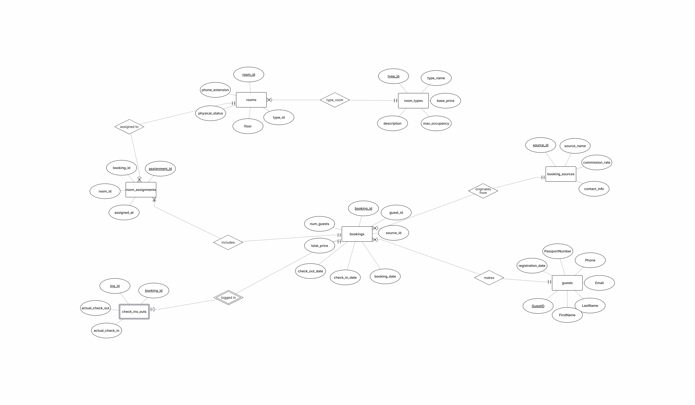
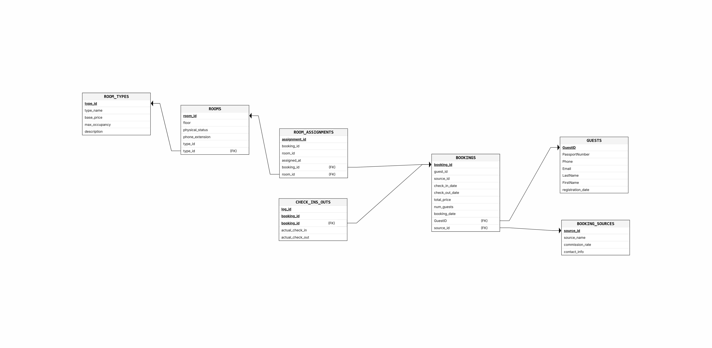

DBProject - Hotel Database System
# 📘 Project Report

This project is a hotel reservations and front office database management system.  
It was developed as part of a database course project.

## 🧑‍💻 Authors

Liel Kriheli 
zivya Hold 

## 🏨 Project Scope

**System:** Hotel Management System  
**Unit:** Reservations and Front Office Department


📌 Table of Contents***************************************************

## 🧾 Overview

This database system is designed to manage hotel reservations and front office operations. It includes data about guests, bookings, rooms, room types, booking sources, room assignments, and check-in/check-out records.

The system uses foreign keys, weak entities, and entity relationships to maintain data consistency, avoid redundancy, and accurately represent the main processes of hotel reservation management.

## 📁 ERD and DSD Diagrams

### ERD



### DSD




# 📘 מילון נתונים – מערכת הזמנות וקבלה במלון

מסמך זה מתאר את מבנה בסיס הנתונים של מערכת הזמנות וקבלה במלון.  
המילון מפרט את מטרת כל טבלה, השדות המרכזיים שלה, האילוצים הקיימים בה, והקשרים שלה עם טבלאות אחרות במערכת.

המערכת נועדה לנהל את תהליך ההזמנה והקבלה במלון, כולל:
- ניהול סוגי חדרים
- ניהול חדרים
- ניהול מקורות הזמנה
- ניהול אורחים
- ניהול הזמנות
- שיוך חדרים להזמנות
- תיעוד כניסה ויציאה בפועל

---

## 📑 תוכן עניינים

1. [ROOM_TYPES – סוגי חדרים](#1-room_types--סוגי-חדרים)
2. [ROOMS – חדרים](#2-rooms--חדרים)
3. [BOOKING_SOURCES – מקורות הזמנה](#3-booking_sources--מקורות-הזמנה)
4. [GUESTS – אורחים](#4-guests--אורחים)
5. [BOOKINGS – הזמנות](#5-bookings--הזמנות)
6. [ROOM_ASSIGNMENTS – שיוך חדרים להזמנות](#6-room_assignments--שיוך-חדרים-להזמנות)
7. [CHECK_INS_OUTS – כניסה ויציאה בפועל](#7-check_ins_outs--כניסה-ויציאה-בפועל)
8. [סיכום קשרים מרכזיים](#-סיכום-קשרים-מרכזיים)
9. [מילון מונחים](#-מילון-מונחים)
10. [הערות עיצוב](#-הערות-עיצוב)

---

# 📘 Data Dictionary

## 1. `ROOM_TYPES` — סוגי חדרים

### תיאור הטבלה

טבלת `ROOM_TYPES` מגדירה את קטגוריות החדרים הקיימות במלון, לדוגמה: חדר זוגי, חדר משפחתי או סוויטה.

במקום לשמור את אותם פרטים עבור כל חדר בנפרד, פרטי סוג החדר נשמרים פעם אחת בטבלה זו, וכל חדר משויך לסוג המתאים לו.  
כך ניתן לשנות מחיר בסיס, תפוסה מקסימלית או תיאור של קטגוריה במקום אחד בלבד.

### שדות הטבלה

| שם השדה | סוג נתון | חובה | תיאור | אילוצים |
|---|---|---|---|---|
| `type_id` | `INT` | כן | מזהה ייחודי לכל סוג חדר | מפתח ראשי |
| `type_name` | `VARCHAR(50)` | כן | שם הקטגוריה, לדוגמה: זוגי, סוויטה | — |
| `base_price` | `NUMERIC(10,2)` | כן | מחיר בסיס ללילה | חייב להיות גדול מ־0 |
| `max_occupancy` | `INT` | כן | מספר האורחים המקסימלי לחדר מסוג זה | בין 1 ל־10 |
| `description` | `VARCHAR(300)` | לא | תיאור חופשי של סוג החדר | — |

### קשרים

- סוג חדר אחד יכול להיות משויך לחדרים רבים.
- הקשר בין `ROOM_TYPES` לבין `ROOMS` הוא קשר של **אחד לרבים**:  
  `ROOM_TYPES 1:N ROOMS`

---

## 2. `ROOMS` — חדרים

### תיאור הטבלה

טבלת `ROOMS` מייצגת את החדרים הפיזיים הקיימים במלון.  
כל רשומה בטבלה מייצגת חדר אחד.

הטבלה שומרת מידע על מספר החדר, הקומה שבה הוא נמצא, מצבו הנוכחי, השלוחה הטלפונית, וסוג החדר שאליו הוא שייך.

### שדות הטבלה

| שם השדה | סוג נתון | חובה | תיאור | אילוצים |
|---|---|---|---|---|
| `room_id` | `INT` | כן | מספר החדר, המשמש גם כמזהה ייחודי | מפתח ראשי |
| `floor` | `INT` | כן | הקומה שבה נמצא החדר | בין 1 ל־50 |
| `physical_status` | `VARCHAR(20)` | כן | המצב הנוכחי של החדר | אחד מהערכים: `AVAILABLE`, `OCCUPIED`, `MAINTENANCE`, `OUT_OF_ORDER` |
| `phone_extension` | `VARCHAR(10)` | לא | שלוחה טלפונית פנימית של החדר | — |
| `type_id` | `INT` | כן | סוג החדר שאליו החדר שייך | מפתח זר אל `ROOM_TYPES(type_id)` |

### קשרים

- כל חדר שייך לסוג חדר אחד בלבד.
- חדר יכול להיות משויך להזמנות רבות לאורך זמן.
- הקשר בין `ROOMS` לבין `ROOM_ASSIGNMENTS` הוא קשר של **אחד לרבים**:  
  `ROOMS 1:N ROOM_ASSIGNMENTS`

---

## 3. `BOOKING_SOURCES` — מקורות הזמנה

### תיאור הטבלה

טבלת `BOOKING_SOURCES` מתעדת את הערוצים השונים שדרכם מתקבלות הזמנות למלון.

לדוגמה:
- אתר המלון
- הזמנה טלפונית
- Booking.com
- סוכן נסיעות
- ערוצים חיצוניים נוספים

עבור כל מקור נשמר גם אחוז העמלה שלו, כדי לאפשר למלון לעקוב אחר עלויות ההזמנה לפי מקור.

### שדות הטבלה

| שם השדה | סוג נתון | חובה | תיאור | אילוצים |
|---|---|---|---|---|
| `source_id` | `INT` | כן | מזהה ייחודי למקור ההזמנה | מפתח ראשי |
| `source_name` | `VARCHAR(100)` | כן | שם מקור ההזמנה | — |
| `commission_rate` | `NUMERIC(5,2)` | כן | אחוז העמלה שהמקור גובה מהמלון | בין 0 ל־100 |
| `contact_info` | `VARCHAR(200)` | לא | פרטי יצירת קשר עם נציג מקור ההזמנה | — |

### קשרים

- מקור הזמנה אחד יכול להיות משויך להזמנות רבות.
- הקשר בין `BOOKING_SOURCES` לבין `BOOKINGS` הוא קשר של **אחד לרבים**:  
  `BOOKING_SOURCES 1:N BOOKINGS`

---

## 4. `GUESTS` — אורחים

### תיאור הטבלה

טבלת `GUESTS` שומרת את פרטיהם האישיים של כל האורחים הרשומים במלון.  
כל רשומה בטבלה מייצגת אורח אחד.

הטבלה משמשת לזיהוי האורח בעת ביצוע הזמנה, בשלב הצ׳ק־אין, ולשמירת פרטי קשר לצורך תקשורת עם האורח.
```sql
CREATE TABLE GUESTS
(
  guest_id          INT           NOT NULL,
  first_name        VARCHAR(50)   NOT NULL,
  last_name         VARCHAR(50)   NOT NULL,
  passport_number   VARCHAR(20)   NOT NULL,
  phone             VARCHAR(20)   NOT NULL,
  email             VARCHAR(100)  NOT NULL,
  registration_date DATE          NOT NULL,

  PRIMARY KEY (guest_id),

  CONSTRAINT uq_guest_passport
    UNIQUE (passport_number),

  CONSTRAINT uq_guest_email
    UNIQUE (email),

  CONSTRAINT chk_email
    CHECK (email LIKE '%@%')
);
```


### שדות הטבלה

| שם השדה | סוג נתון | חובה | תיאור | אילוצים |
|---|---|---|---|---|
| `guest_id` | `INT` | כן | מזהה ייחודי לכל אורח | מפתח ראשי |
| `first_name` | `VARCHAR(50)` | כן | שם פרטי של האורח | — |
| `last_name` | `VARCHAR(50)` | כן | שם משפחה של האורח | — |
| `passport_number` | `VARCHAR(20)` | כן | מספר דרכון לזיהוי רשמי בצ׳ק־אין | ייחודי |
| `phone` | `VARCHAR(20)` | כן | מספר טלפון ליצירת קשר | — |
| `email` | `VARCHAR(100)` | כן | כתובת דואר אלקטרוני | ייחודי, חייב להכיל `@` |
| `registration_date` | `DATE` | כן | תאריך ההרשמה הראשונה של האורח למערכת | — |

### קשרים

- אורח אחד יכול לבצע הזמנות רבות.
- הקשר בין `GUESTS` לבין `BOOKINGS` הוא קשר של **אחד לרבים**:  
  `GUESTS 1:N BOOKINGS`

---

## 5. `BOOKINGS` — הזמנות

### תיאור הטבלה

טבלת `BOOKINGS` היא הטבלה המרכזית של המערכת.  
כל רשומה בטבלה מייצגת הזמנה אחת שבוצעה במלון.

הטבלה מחברת בין האורח שביצע את ההזמנה, מקור ההזמנה, תאריכי השהייה המתוכננים, מספר האורחים והמחיר הכולל של ההזמנה.

### שדות הטבלה

| שם השדה | סוג נתון | חובה | תיאור | אילוצים |
|---|---|---|---|---|
| `booking_id` | `INT` | כן | מספר הזמנה ייחודי | מפתח ראשי |
| `booking_date` | `DATE` | כן | התאריך שבו ההזמנה נוצרה במערכת | — |
| `check_in_date` | `DATE` | כן | תאריך הכניסה המתוכנן | — |
| `check_out_date` | `DATE` | כן | תאריך היציאה המתוכנן | חייב להיות אחרי `check_in_date` |
| `num_guests` | `INT` | כן | מספר האורחים הכלולים בהזמנה | לפחות 1 |
| `total_price` | `NUMERIC(10,2)` | כן | המחיר הכולל של ההזמנה בשקלים | לא יכול להיות שלילי |
| `guest_id` | `INT` | כן | האורח שביצע את ההזמנה | מפתח זר אל `GUESTS(guest_id)` |
| `source_id` | `INT` | כן | מקור ההזמנה | מפתח זר אל `BOOKING_SOURCES(source_id)` |

### קשרים

- כל הזמנה שייכת לאורח אחד בלבד.
- כל הזמנה מגיעה ממקור הזמנה אחד בלבד.
- הזמנה אחת יכולה לכלול חדרים רבים באמצעות `ROOM_ASSIGNMENTS`.
- להזמנה יכולה להיות רשומת כניסה ויציאה בפועל באמצעות `CHECK_INS_OUTS`.

---

## 6. `ROOM_ASSIGNMENTS` — שיוך חדרים להזמנות

### תיאור הטבלה

טבלת `ROOM_ASSIGNMENTS` היא ישות מקשרת בין הזמנות לבין חדרים.

היא פותרת קשר של **רבים לרבים** בין `BOOKINGS` לבין `ROOMS`:

- הזמנה אחת יכולה לכלול כמה חדרים.
- חדר אחד יכול להיות משויך להזמנות שונות בתקופות שונות.

לדוגמה, משפחה יכולה להזמין שני חדרים באותה הזמנה, ואותו חדר יכול להופיע בהזמנה אחרת בתאריכים אחרים.

### שדות הטבלה

| שם השדה | סוג נתון | חובה | תיאור | אילוצים |
|---|---|---|---|---|
| `assignment_id` | `INT` | כן | מזהה ייחודי לשיבוץ חדר להזמנה | מפתח ראשי |
| `assigned_at` | `DATE` | כן | התאריך שבו בוצע שיוך החדר להזמנה | — |
| `booking_id` | `INT` | כן | ההזמנה שאליה החדר משויך | מפתח זר אל `BOOKINGS(booking_id)` |
| `room_id` | `INT` | כן | החדר ששויך להזמנה | מפתח זר אל `ROOMS(room_id)` |

### קשרים

- הטבלה מחברת בין `BOOKINGS` לבין `ROOMS`.
- הטבלה מממשת קשר **M:N** בין הזמנות לחדרים.
- השילוב של `booking_id` ו־`room_id` צריך להיות ייחודי, כדי למנוע שיוך כפול של אותו חדר לאותה הזמנה.

---

## 7. `CHECK_INS_OUTS` — כניסה ויציאה בפועל

### תיאור הטבלה

טבלת `CHECK_INS_OUTS` היא ישות חלשה התלויה בטבלת `BOOKINGS`.

הטבלה שומרת את נתוני הכניסה והיציאה בפועל של אורחים בדלפק הקבלה, ומאפשרת להשוות בין תאריכי השהייה שתוכננו בהזמנה לבין מה שקרה בפועל.

לדוגמה:  
אורח תכנן לבצע כניסה בתאריך 1 ביולי, אך בפועל הגיע רק ב־2 ביולי.  
במקרה כזה, התאריך המתוכנן נשמר בטבלת `BOOKINGS`, והתאריך בפועל נשמר בטבלת `CHECK_INS_OUTS`.

### שדות הטבלה

| שם השדה | סוג נתון | חובה | תיאור | אילוצים |
|---|---|---|---|---|
| `log_id` | `INT` | כן | מזהה חלקי של רשומת הכניסה/יציאה | חלק ממפתח ראשי מורכב |
| `booking_id` | `INT` | כן | ההזמנה שאליה שייכת הרשומה | חלק ממפתח ראשי מורכב + מפתח זר אל `BOOKINGS(booking_id)` |
| `actual_check_in` | `DATE` | לא | תאריך הכניסה בפועל | — |
| `actual_check_out` | `DATE` | לא | תאריך היציאה בפועל | — |

### קשרים

- זוהי ישות חלשה שתלויה לחלוטין בטבלת `BOOKINGS`.
- רשומת כניסה/יציאה לא יכולה להתקיים ללא הזמנה קיימת.
- המפתח הראשי של הטבלה הוא מפתח מורכב:  
  `(log_id, booking_id)`.
- לכל הזמנה יכולה להיות רשומת כניסה/יציאה אחת.

---

``` sql
CREATE TABLE ROOM_TYPES
(
  type_id       INT            NOT NULL,
  type_name     VARCHAR(50)    NOT NULL,
  base_price    NUMERIC(10,2)  NOT NULL,
  max_occupancy INT            NOT NULL,
  description   VARCHAR(300),

  PRIMARY KEY (type_id),

  CONSTRAINT uq_room_type_name
    UNIQUE (type_name),

  CONSTRAINT chk_base_price
    CHECK (base_price > 0),

  CONSTRAINT chk_max_occupancy
    CHECK (max_occupancy BETWEEN 1 AND 10)
);

CREATE TABLE ROOMS
(
  room_id         INT          NOT NULL,
  floor           INT          NOT NULL,
  physical_status VARCHAR(20)  NOT NULL DEFAULT 'AVAILABLE',
  phone_extension VARCHAR(10),
  type_id         INT          NOT NULL,

  PRIMARY KEY (room_id),

  FOREIGN KEY (type_id)
    REFERENCES ROOM_TYPES(type_id),

  CONSTRAINT chk_room_status
    CHECK (physical_status IN ('AVAILABLE', 'OCCUPIED', 'MAINTENANCE', 'OUT_OF_ORDER')),

  CONSTRAINT chk_floor
    CHECK (floor BETWEEN 1 AND 50),

  CONSTRAINT uq_phone_extension
    UNIQUE (phone_extension)
);

CREATE TABLE BOOKING_SOURCES
(
  source_id       INT           NOT NULL,
  source_name     VARCHAR(100)  NOT NULL,
  commission_rate NUMERIC(5,2)  NOT NULL,
  contact_info    VARCHAR(200),

  PRIMARY KEY (source_id),

  CONSTRAINT uq_source_name
    UNIQUE (source_name),

  CONSTRAINT chk_commission
    CHECK (commission_rate BETWEEN 0 AND 100)
);

CREATE TABLE GUESTS
(
  guest_id          INT           NOT NULL,
  first_name        VARCHAR(50)   NOT NULL,
  last_name         VARCHAR(50)   NOT NULL,
  passport_number   VARCHAR(20)   NOT NULL,
  phone             VARCHAR(20)   NOT NULL,
  email             VARCHAR(100)  NOT NULL,
  registration_date DATE          NOT NULL,

  PRIMARY KEY (guest_id),

  CONSTRAINT uq_guest_passport
    UNIQUE (passport_number),

  CONSTRAINT uq_guest_email
    UNIQUE (email),

  CONSTRAINT chk_email
    CHECK (email LIKE '%@%')
);

CREATE TABLE BOOKINGS
(
  booking_id     INT            NOT NULL,
  check_in_date  DATE           NOT NULL,
  check_out_date DATE           NOT NULL,
  total_price    NUMERIC(10,2)  NOT NULL,
  num_guests     INT            NOT NULL,
  booking_date   DATE           NOT NULL,
  guest_id       INT            NOT NULL,
  source_id      INT            NOT NULL,

  PRIMARY KEY (booking_id),

  FOREIGN KEY (guest_id)
    REFERENCES GUESTS(guest_id),

  FOREIGN KEY (source_id)
    REFERENCES BOOKING_SOURCES(source_id),

  CONSTRAINT chk_booking_dates
    CHECK (check_out_date > check_in_date),

  CONSTRAINT chk_booking_date_before_checkin
    CHECK (booking_date <= check_in_date),

  CONSTRAINT chk_num_guests
    CHECK (num_guests >= 1),

  CONSTRAINT chk_total_price
    CHECK (total_price >= 0)
);

CREATE TABLE ROOM_ASSIGNMENTS
(
  assignment_id INT  NOT NULL,
  assigned_at   DATE NOT NULL,
  booking_id    INT  NOT NULL,
  room_id       INT  NOT NULL,

  PRIMARY KEY (assignment_id),

  FOREIGN KEY (booking_id)
    REFERENCES BOOKINGS(booking_id),

  FOREIGN KEY (room_id)
    REFERENCES ROOMS(room_id),

  CONSTRAINT uq_booking_room
    UNIQUE (booking_id, room_id)
);

CREATE TABLE CHECK_INS_OUTS
(
  log_id           INT  NOT NULL,
  actual_check_in  DATE,
  actual_check_out DATE,
  booking_id       INT  NOT NULL,

  PRIMARY KEY (log_id, booking_id),

  FOREIGN KEY (booking_id)
    REFERENCES BOOKINGS(booking_id),

  CONSTRAINT chk_actual_check_dates
    CHECK (
      actual_check_out IS NULL
      OR actual_check_in IS NULL
      OR actual_check_out >= actual_check_in
    )
);
```

# 🔗 סיכום קשרים מרכזיים

| קשר | סוג קשר | משמעות |
|---|---|---|
| `GUESTS` → `BOOKINGS` | 1:N | אורח אחד יכול לבצע הזמנות רבות |
| `BOOKING_SOURCES` → `BOOKINGS` | 1:N | מקור הזמנה אחד יכול להביא הזמנות רבות |
| `ROOM_TYPES` → `ROOMS` | 1:N | קטגוריה אחת כוללת חדרים רבים |
| `BOOKINGS` ↔ `ROOMS` | M:N | הזמנה יכולה לכלול חדרים רבים, וחדר יכול להופיע בהזמנות רבות לאורך זמן |
| `BOOKINGS` → `CHECK_INS_OUTS` | 1:1 | לכל הזמנה יכולה להיות רשומת כניסה/יציאה בפועל |


