# 📘 דוח הפרויקט – שלב ב': שאילתות, טרנזקציות ואילוצים

חלק זה מתעד את שלב תשאול בסיס הנתונים, ייעול השאילתות באמצעות אינדקסים, שמירה על שלמות הנתונים באמצעות אילוצים, וניהול טרנזקציות (Commit & Rollback). שאילתות אלו הותאמו במיוחד למסכי המערכת (Dashboard ו-Front Office) ויוצגו בהמשך ב-GUI של המערכת.

---

## 📑 תוכן עניינים – שלב ב'

1. [שאילתות SELECT כפולות והשוואת יעילות](#1-שאילתות-select-כפולות-והשוואת-יעילות)
2. [שאילתות SELECT נוספות ומורכבות](#2-שאילתות-select-נוספות-ומורכבות)
3. [שאילתות UPDATE (עדכון נתונים)](#3-שאילתות-update-עדכון-נתונים)
4. [שאילתות DELETE (מחיקת נתונים)](#4-שאילתות-delete-מחיקת-נתונים)
5. [ניהול טרנזקציות – Rollback & Commit](#5-ניהול-טרנזקציות--rollback--commit)
6. [הוספת אילוצים (Constraints) ובדיקתם](#6-הוספת-אילוצים-constraints-ובדיקתם)
7. [אינדקסים (Indexes) וניתוח זמני ריצה](#7-אינדקסים-indexes-וניתוח-זמני-ריצה)

---

## 1. שאילתות SELECT כפולות והשוואת יעילות

סעיף זה מציג 4 שאילתות שנכתבו בשתי צורות שונות כדי להשוות את יעילותן ואת תוכניות הביצוע (Query Plans) של בסיס הנתונים.

### 📊 שאילתה 2: הכנסות חודשיות לפי שנה וחודש
* **תיאור בעברית:** מציג את סך ההכנסות, מחיר ממוצע להזמנה ומספר ההזמנות הכולל בחלוקה לפי שנה וחודש, עבור הזמנות שאינן מבוטלות. משתמש בפירוק תאריך (`EXTRACT`).
* **מתאים למסך:** Dashboard / מנהל - דוח הכנסות תקופתי.

#### צורה א': שימוש ישיר ב-GROUP BY על פירוק התאריך (2A)
```sql
SELECT
    EXTRACT(YEAR FROM b.check_in_date) AS booking_year,
    EXTRACT(MONTH FROM b.check_in_date) AS booking_month,
    COUNT(*) AS number_of_bookings,
    SUM(b.total_price) AS total_revenue,
    AVG(b.total_price) AS average_booking_price
FROM BOOKINGS b
WHERE b.booking_status IN ('CONFIRMED', 'COMPLETED')
GROUP BY
    EXTRACT(YEAR FROM b.check_in_date),
    EXTRACT(MONTH FROM b.check_in_date)
ORDER BY booking_year, booking_month;
```

##### צילום הרצה ותוצאה צורה א':
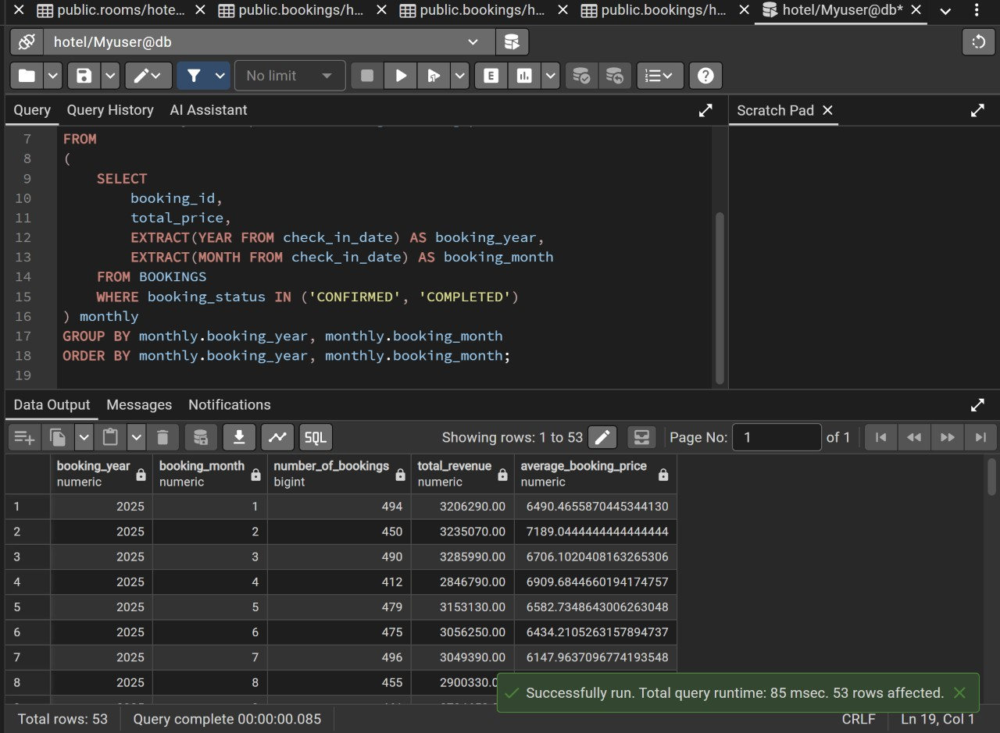

#### צורה ב': שימוש בתת-שאילתה (Subquery) המפרקת את התאריך תחילה (2B)
```sql
SELECT
    monthly.booking_year,
    monthly.booking_month,
    COUNT(*) AS number_of_bookings,
    SUM(monthly.total_price) AS total_revenue,
    AVG(monthly.total_price) AS average_booking_price
FROM
(
    SELECT
        booking_id,
        total_price,
        EXTRACT(YEAR FROM check_in_date) AS booking_year,
        EXTRACT(MONTH FROM check_in_date) AS booking_month
    FROM BOOKINGS
    WHERE booking_status IN ('CONFIRMED', 'COMPLETED')
) monthly
GROUP BY monthly.booking_year, monthly.booking_month
ORDER BY monthly.booking_year, monthly.booking_month;
```


##### צילום הרצה ותוצאה צורה ב':
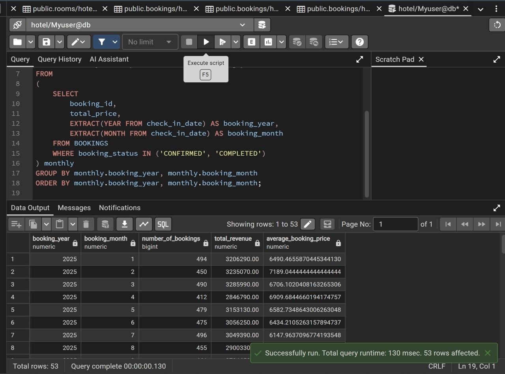


#### הסבר הבדלים ויעילות:
מערכת PostgreSQL מייעלת את שתי השאילתות בצורה דומה מאוד בעזרת ה-Query Optimizer שלה. עם זאת, צורה א' (2A) עדיפה ויעילה יותר. היא ניגשת ישירות לטבלה ומבצעת את הקיבוץ והסינון בשלב אחד מבלי ליצור מבנה נתונים זמני בזיכרון (Inline View). צורה ב' יוצרת תת-שאילתה שלא לצורך ומקשה על קריאות הקוד.


### 🛏️שאילתה 3: מספר חדרים פנויים לפי סוג חדר
* **תיאור בעברית:** מציג את רשימת סוגי החדרים, מחירם, התפוסה המקסימלית שלהם וכמות החדרים הפנויים פיזית כעת במלון מכל סוג.

* **מתאים למסך:** Front Office / ניהול קבלה ומצב חדרים.
#### צורה א': שימוש ב-JOIN ו-GROUP BY סטנדרטי (3A)

```sql
SELECT
    rt.type_name,
    rt.base_price,
    rt.max_occupancy,
    COUNT(r.room_id) AS available_rooms
FROM ROOM_TYPES rt
JOIN ROOMS r ON rt.type_id = r.type_id
WHERE r.physical_status = 'AVAILABLE'
GROUP BY rt.type_name, rt.base_price, rt.max_occupancy
ORDER BY available_rooms DESC, rt.type_name;
```
##### צילום הרצה ותוצאה צורה א':
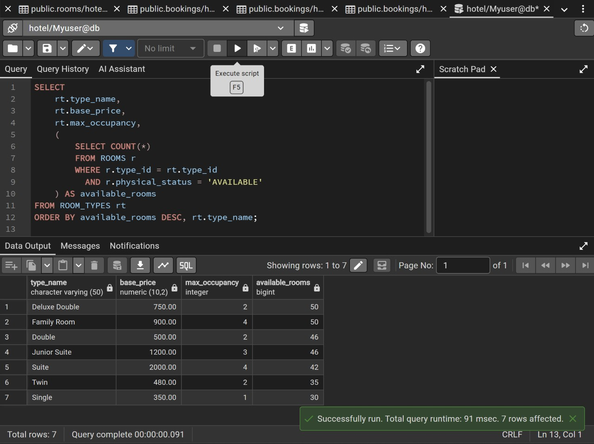


#### צורה ב': שימוש בתת-שאילתה קורלטיבית (Correlated Subquery) ב-SELECT (3B)

```sql
SELECT
    rt.type_name,
    rt.base_price,
    rt.max_occupancy,
    (
        SELECT COUNT(*)
        FROM ROOMS r
        WHERE r.type_id = rt.type_id
          AND r.physical_status = 'AVAILABLE'
    ) AS available_rooms
FROM ROOM_TYPES rt
ORDER BY available_rooms DESC, rt.type_name;
```

##### צילום הרצה ותוצאה צורה ב':
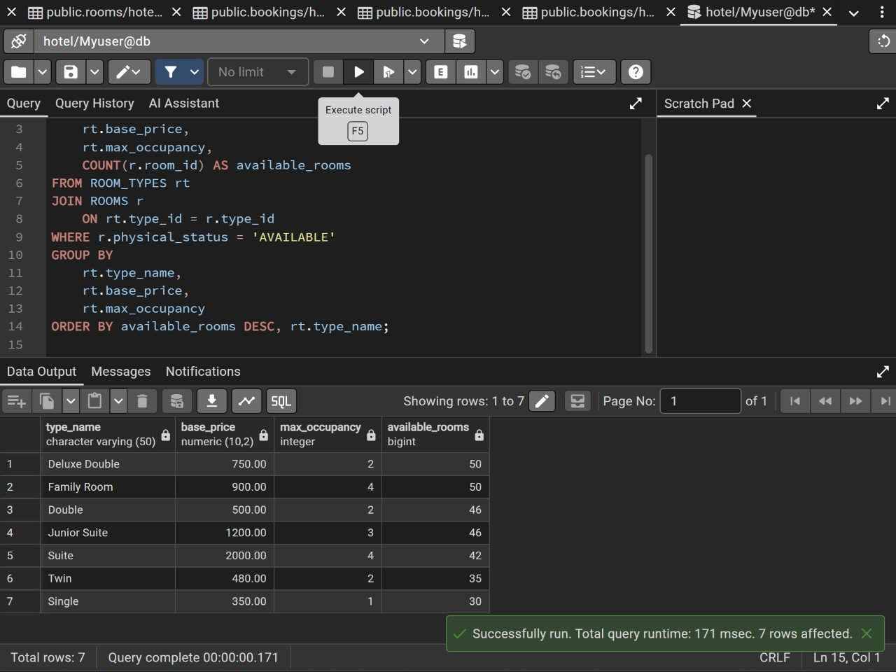


#### הסבר הבדלים ויעילות:
 צורה א' (3A) יעילה משמעותית. היא מבצעת צירוף (Hash Join או Merge Join) פעם אחת על כל הנתונים ומקבצת אותם. צורה ב' (3B) משתמשת בתת-שאילתה קורלטיבית, מה שאומר שעבור כל שורה בטבלת ROOM_TYPES, בסיס הנתונים נאלץ להריץ מחדש שאילתת ספירה על טבלת ROOMS. במערכת עם הרבה קטגוריות נתונים, צורה ב' תגרום לפגיעה קשה בביצועים.

 
### 👥 שאילתה 4: כמות הזמנות וסך הוצאות של כל אורח במערכת

* **תיאור בעברית:** מציג את פרטי האורח (שם, טלפון, אימייל) יחד עם כמות ההזמנות שביצע אי פעם וסך כל הכסף שהוציא במלון (כולל אורחים שלא הזמינו מעולם, שיוצגו עם 0 בעזרת COALESCE).

* **מתאים למסך:** ניהול אורחים (Guests Management) / מועדון לקוחות.

#### צורה א': שימוש ב-LEFT JOIN ו-GROUP BY (4A)
```sql

SELECT
    g.guest_id,
    g.first_name || ' ' || g.last_name AS guest_name,
    g.phone,
    g.email,
    COUNT(b.booking_id) AS total_bookings,
    COALESCE(SUM(b.total_price), 0) AS total_spent
FROM GUESTS g
LEFT JOIN BOOKINGS b ON g.guest_id = b.guest_id
GROUP BY g.guest_id, g.first_name, g.last_name, g.phone, g.email
ORDER BY total_spent DESC, total_bookings DESC;
```
##### צילום הרצה ותוצאה צורה א':
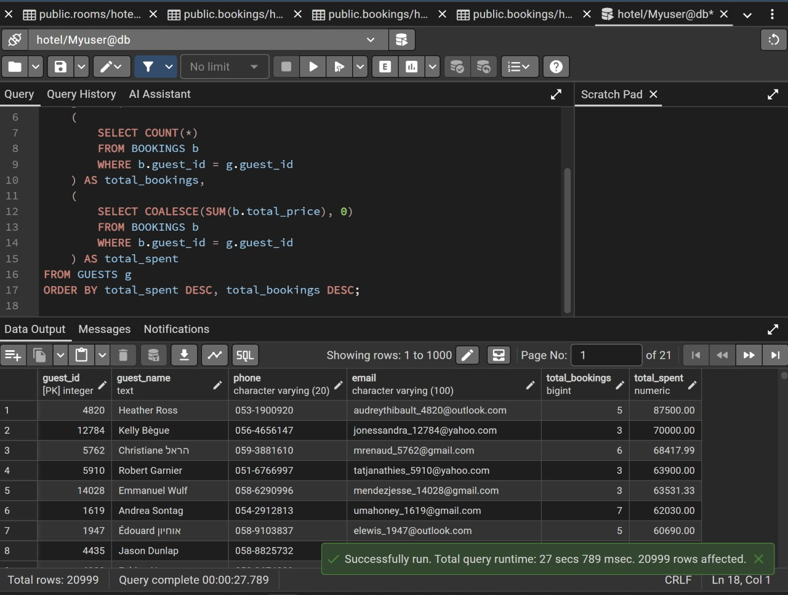

#### צורה ב': שימוש בשתי תת-שאילתות נפרדות בתוך ה-SELECT (4B)
```sql
SELECT
    g.guest_id,
    g.first_name || ' ' || g.last_name AS guest_name,
    g.phone,
    g.email,
    (
        SELECT COUNT(*)
        FROM BOOKINGS b
        WHERE b.guest_id = g.guest_id
    ) AS total_bookings,
    (
        SELECT COALESCE(SUM(b.total_price), 0)
        FROM BOOKINGS b
        WHERE b.guest_id = g.guest_id
    ) AS total_spent
FROM GUESTS g
ORDER BY total_spent DESC, total_bookings DESC;
```
##### צילום הרצה ותוצאה צורה ב':
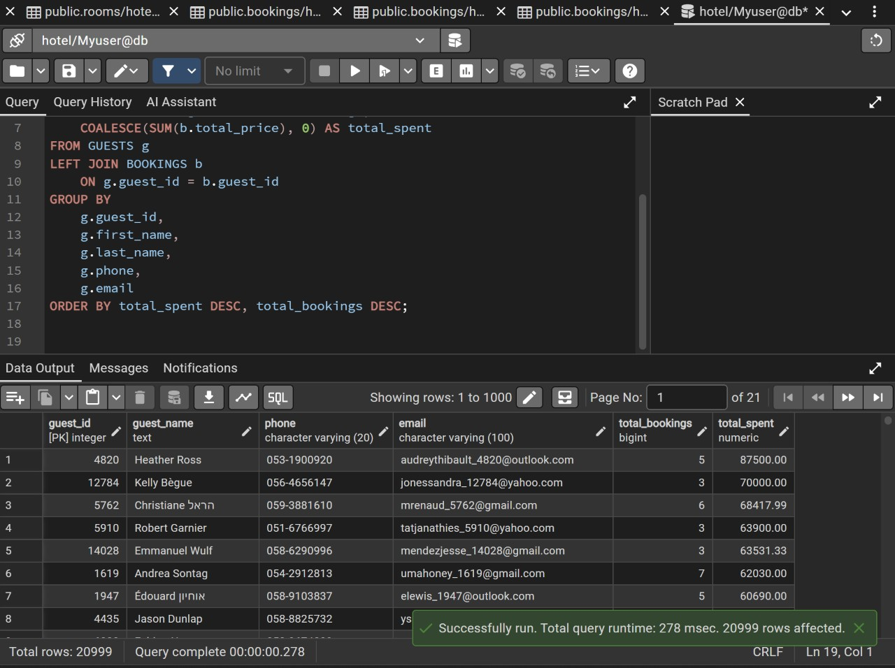

##### הסבר הבדלים ויעילות:
צורה א' (4A) היא המנצחת הברורה מבחינת יעילות. היא סורקת את טבלת האורחים ואת טבלת ההזמנות פעם אחת בלבד ומחברת ביניהן. צורה ב' (4B) מייצרת שתי תת-שאילתות נפרדות לכל שורת אורח, מה שגורם לכמות עצומה של קריאות דיסק וסריקות חוזרות של טבלת BOOKINGS.

### ⚠️ שאילתה 5: הזמנות מאושרות שעדיין לא שויך להן חדר
* **תיאור בעברית:** מוצאת את כל ההזמנות העתידיות שסטטוס שלהן הוא 'CONFIRMED' אך פקידי הקבלה עדיין לא שיבצו להן חדר פיזי. השאילתה מציגה פרטי הזמנה ושם אורח.
 
* **מתאים למסך:** Front Office / ניהול קבלה / משימות לטיפול.
  
#### צורה א': שימוש ב-LEFT JOIN וחיפוש ערכי NULL (5A)
```sql
SELECT
    b.booking_id,
    g.first_name || ' ' || g.last_name AS guest_name,
    b.check_in_date,
    b.check_out_date,
    b.num_guests,
    b.booking_status
FROM BOOKINGS b
JOIN GUESTS g ON b.guest_id = g.guest_id
LEFT JOIN ROOM_ASSIGNMENTS ra ON b.booking_id = ra.booking_id
WHERE ra.assignment_id IS NULL
  AND b.booking_status = 'CONFIRMED'
ORDER BY b.check_in_date;
```
##### צילום הרצה ותוצאה צורה א':

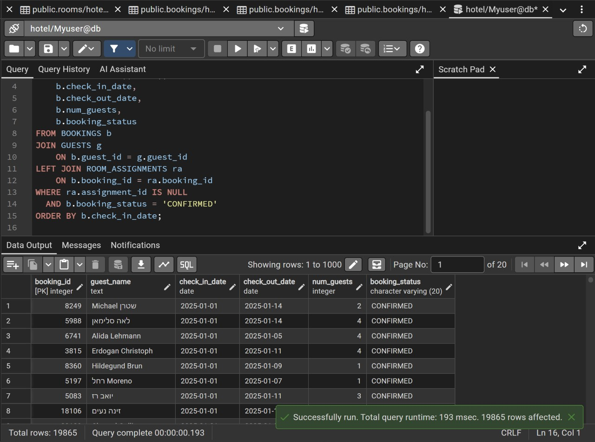

#### צורה ב': שימוש באופרטור NOT EXISTS (5B)

```sql
SELECT
    b.booking_id,
    g.first_name || ' ' || g.last_name AS guest_name,
    b.check_in_date,
    b.check_out_date,
    b.num_guests,
    b.booking_status
FROM BOOKINGS b
JOIN GUESTS g ON b.guest_id = g.guest_id
WHERE NOT EXISTS
(
    SELECT 1
    FROM ROOM_ASSIGNMENTS ra
    WHERE ra.booking_id = b.booking_id
)
AND b.booking_status = 'CONFIRMED'
ORDER BY b.check_in_date;
```

##### צילום הרצה ותוצאה צורה ב':

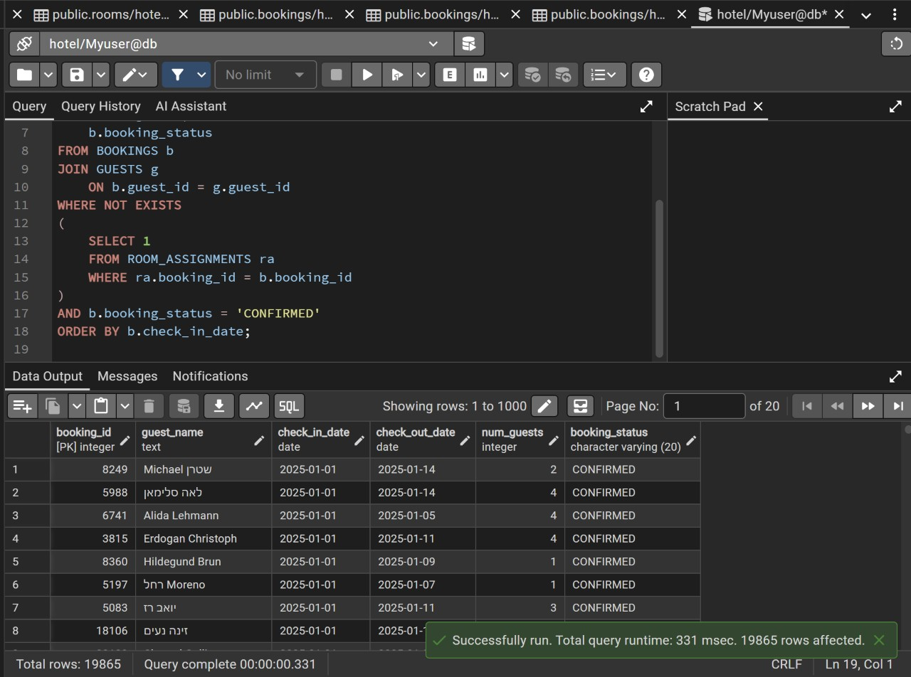

#### הסבר הבדלים ויעילות:

ב-PostgreSQL מודרני, שתי הצורות יתורגמו לעיתים קרובות לאותה תוכנית ביצוע של Anti-Join. עם זאת, צורה ב' (NOT EXISTS) נחשבת לרוב לעדיפה וברורה יותר סמנטית. היא מפסיקה את הסריקה של טבלת השיבוצים ברגע שהיא מוצאת התאמה ראשונה עבור ההזמנה, בניגוד ל-LEFT JOIN (צורה א') שמאלץ את בסיס הנתונים לבנות את כל הצירוף בזיכרון ואז לסנן את שורות ה-NULL.

## 2. שאילתות SELECT נוספות ומורכבות
### 📅 שאילתה 1: לוח בקרה להזמנות עתידיות קרובות
 **תיאור בעברית:** מציג רשימה מפורטת של הזמנות עתידיות שמאושרות במערכת, כולל שם האורח המלא, מקור ההזמנה, תאריכי השהייה והמחיר. השאילתה מחברת 3 טבלאות.
##### קוד השאילתה:

```sql
SELECT
    b.booking_id,
    g.first_name || ' ' || g.last_name AS guest_name,
    bs.source_name,
    b.check_in_date,
    b.check_out_date,
    b.num_guests,
    b.total_price,
    b.booking_status
FROM BOOKINGS b
JOIN GUESTS g ON b.guest_id = g.guest_id
JOIN BOOKING_SOURCES bs ON b.source_id = bs.source_id
WHERE b.check_in_date >= CURRENT_DATE
  AND b.booking_status = 'CONFIRMED'
ORDER BY b.check_in_date ASC, b.booking_id ASC;
```

##### צילום הרצה ותוצאה:
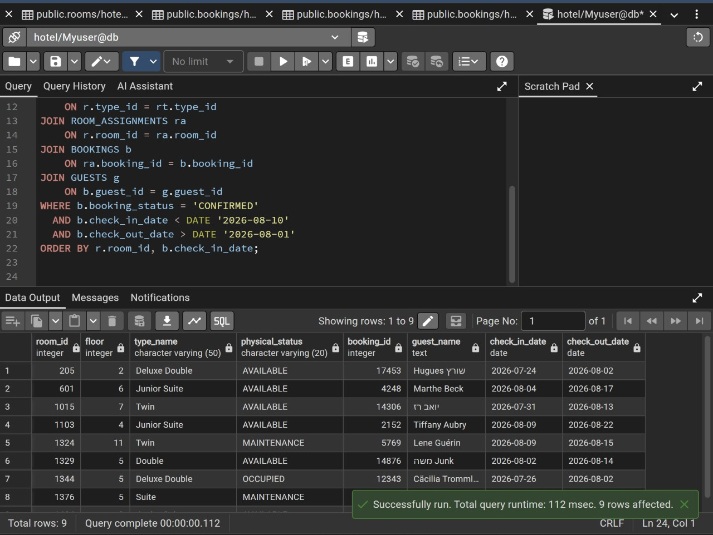

### 💰 שאילתה 6: ביצועי מקורות הזמנה וחישובי עמלות
**תיאור בעברית:** שאילתה פיננסית המנתחת את היקף ההזמנות מכל ערוץ שיווקי. השאילתה מציגה את שם הערוץ, כמות הזמנות, הכנסה גולמית, סך העמלה המשוערת שהמלון משלם לערוץ, וההכנסה נטו שנשארה למלון.

##### קוד השאילתה:

```sql
SELECT
    bs.source_id,
    bs.source_name,
    bs.commission_rate,
    COUNT(b.booking_id) AS total_bookings,
    SUM(b.total_price) AS gross_revenue,
    SUM(b.total_price * bs.commission_rate / 100) AS estimated_commission,
    SUM(b.total_price - (b.total_price * bs.commission_rate / 100)) AS net_revenue
FROM BOOKING_SOURCES bs
JOIN BOOKINGS b ON bs.source_id = b.source_id
WHERE b.booking_status IN ('CONFIRMED', 'COMPLETED')
GROUP BY bs.source_id, bs.source_name, bs.commission_rate
ORDER BY net_revenue DESC;
```
##### צילום הרצה ותוצאה:
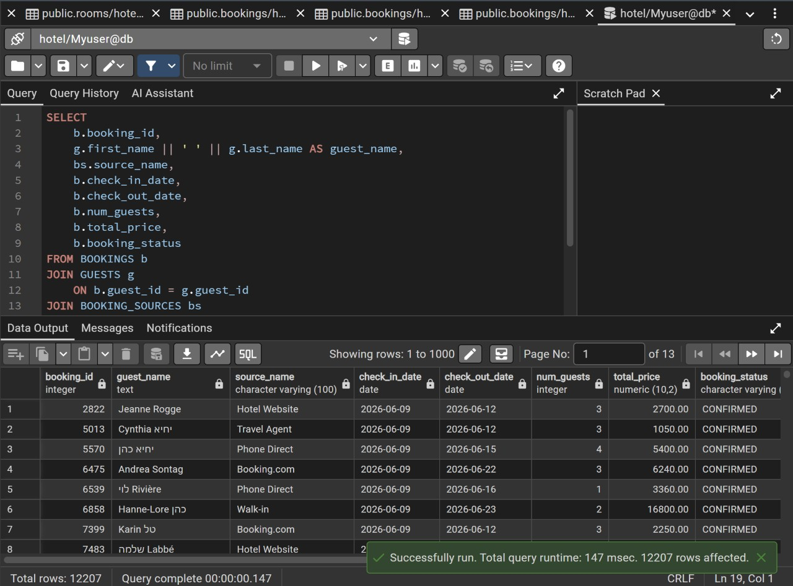

### 🛎️ שאילתה 7: השוואת זמני כניסה/יציאה מתוכננים מול המציאות בפועל
**תיאור בעברית:** שאילתת בקרה המפרקת את תאריך הכניסה בפועל לימים, חודשים ושנים. היא משתמשת בבלוק CASE WHEN כדי לסווג את הגעת האורח (הגיע בזמן, הגיע באיחור, או הקדים) בהשוואה לתאריך המקורי שהזמין.

##### קוד השאילתה:

```sql
SELECT
    b.booking_id,
    g.first_name || ' ' || g.last_name AS guest_name,
    b.check_in_date AS planned_check_in,
    cio.actual_check_in,
    EXTRACT(DAY FROM cio.actual_check_in) AS actual_check_in_day,
    EXTRACT(MONTH FROM cio.actual_check_in) AS actual_check_in_month,
    EXTRACT(YEAR FROM cio.actual_check_in) AS actual_check_in_year,
    b.check_out_date AS planned_check_out,
    cio.actual_check_out,
    CASE
        WHEN cio.actual_check_in > b.check_in_date THEN 'LATE_CHECK_IN'
        WHEN cio.actual_check_in < b.check_in_date THEN 'EARLY_CHECK_IN'
        WHEN cio.actual_check_in = b.check_in_date THEN 'ON_TIME'
        ELSE 'NOT_CHECKED_IN_YET'
    END AS check_in_status
FROM BOOKINGS b
JOIN GUESTS g ON b.guest_id = g.guest_id
LEFT JOIN CHECK_INS_OUTS cio ON b.booking_id = cio.booking_id
ORDER BY b.check_in_date DESC, b.booking_id;
```
##### צילום הרצה ותוצאה:

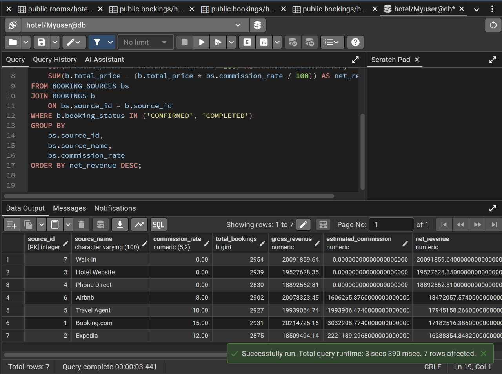

### 🔍 שאילתה 8: חיפוש חדרים תפוסים בטווח תאריכים מוגדר
**תיאור בעברית:** מאפשרת לפקידי הקבלה לראות אילו חדרים משובצים ותפוסים עבור טווח תאריכים ספציפי (לדוגמה בין ה-01 ל-10 באוגוסט 2026), כדי למנוע כפל הזמנות (Overbooking).
##### קוד השאילתה:


```sql
SELECT
    r.room_id,
    r.floor,
    rt.type_name,
    r.physical_status,
    b.booking_id,
    g.first_name || ' ' || g.last_name AS guest_name,
    b.check_in_date,
    b.check_out_date
FROM ROOMS r
JOIN ROOM_TYPES rt ON r.type_id = rt.type_id
JOIN ROOM_ASSIGNMENTS ra ON r.room_id = ra.room_id
JOIN BOOKINGS b ON ra.booking_id = b.booking_id
JOIN GUESTS g ON b.guest_id = g.guest_id
WHERE b.booking_status = 'CONFIRMED'
  AND b.check_in_date < DATE '2026-08-10'
  AND b.check_out_date > DATE '2026-08-01'
ORDER BY r.room_id, b.check_in_date;
```
##### צילום הרצה ותוצאה:

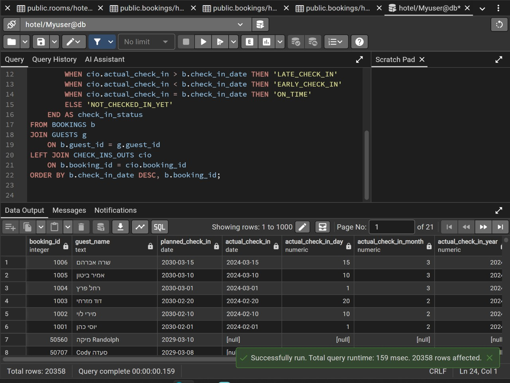
## 3. שאילתות UPDATE (עדכון נתונים)
    
###  ⬆️ עדכון 1: שינוי סטטוס חדר ל-'OCCUPIED' בעת צ'ק-אין בפועל


**מלל בעברית:** מעדכן אוטומטית את הסטטוס הפיזי של החדרים ל-'OCCUPIED' אם קיים עבורם לוג כניסה שבו האורח נכנס למלון אך טרם ביצע צ'ק-אאוט.
##### קוד השאילתה:


```sql

UPDATE ROOMS r
SET physical_status = 'OCCUPIED'
WHERE r.room_id IN
(
    SELECT ra.room_id
    FROM ROOM_ASSIGNMENTS ra
    JOIN CHECK_INS_OUTS cio ON ra.booking_id = cio.booking_id
    WHERE cio.actual_check_in IS NOT NULL
      AND cio.actual_check_out IS NULL
);
```

##### צילום מסך – הרצה, ומצב בסיס הנתונים לפני ואחרי:


    
###  ⬆️ עדכון 2: סגירת סטטוס הזמנה ל-'COMPLETED' לאחר עזיבה 


**מלל בעברית:** מעדכן את סטטוס ההזמנה בטבלת ההזמנות ל-'COMPLETED' ברגע שנרשם תאריך יציאה בפועל (actual_check_out) בדלפק הקבלה.

##### קוד השאילתה:

```sql

UPDATE BOOKINGS b
SET booking_status = 'COMPLETED'
WHERE EXISTS
(
    SELECT 1
    FROM CHECK_INS_OUTS cio
    WHERE cio.booking_id = b.booking_id
      AND cio.actual_check_out IS NOT NULL
);
```
##### צילום מסך – הרצה, ומצב בסיס הנתונים לפני ואחרי:

###  ⬆️ עדכון 3: עדכון מחירים יזום להזמנות עתידיות מערוצים יקרים

**מלל בעברית:** מעלה ב-10% את המחיר הכולל של הזמנות עתידיות מאושרות שמגיעות ממקורות הזמנה חיצוניים שגובים מהמלון עמלה גבוהה (מעל 15%), כדי לאזן את רווחי המלון.
##### קוד השאילתה:


```sql

UPDATE BOOKINGS b
SET total_price = total_price * 1.10
WHERE b.booking_status = 'CONFIRMED'
  AND b.check_in_date > CURRENT_DATE
  AND b.source_id IN
  (
      SELECT bs.source_id
      FROM BOOKING_SOURCES bs
      WHERE bs.commission_rate > 15
  );
```
##### צילום מסך – הרצה, ומצב בסיס הנתונים לפני ואחרי:


## 4. שאילתות DELETE (מחיקת נתונים)
### ✖️ מחיקה 1: הסרת שיוכי חדרים עבור הזמנות עתידיות שבוטלו
**מלל בעברית:** מוחק מטבלת ROOM_ASSIGNMENTS את כל שיבוצי החדרים של הזמנות עתידיות שקיבלו סטטוס 'CANCELLED', כדי לשחרר את החדרים חזרה למלאי המלון.
##### קוד השאילתה:


```sql

DELETE FROM ROOM_ASSIGNMENTS ra
WHERE ra.booking_id IN
(
    SELECT b.booking_id
    FROM BOOKINGS b
    WHERE b.booking_status = 'CANCELLED'
      AND b.check_in_date > CURRENT_DATE
);
```

##### צילום מסך – הרצה, ומצב לפני ואחרי:
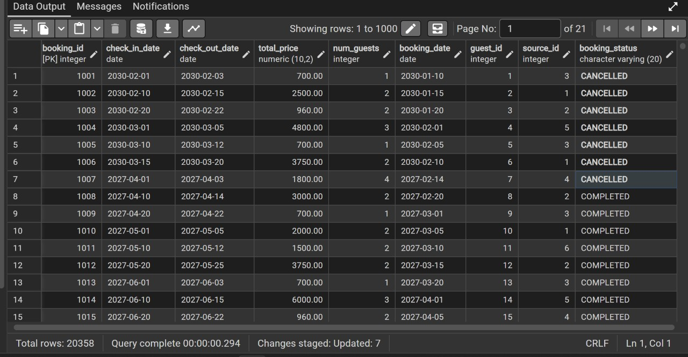
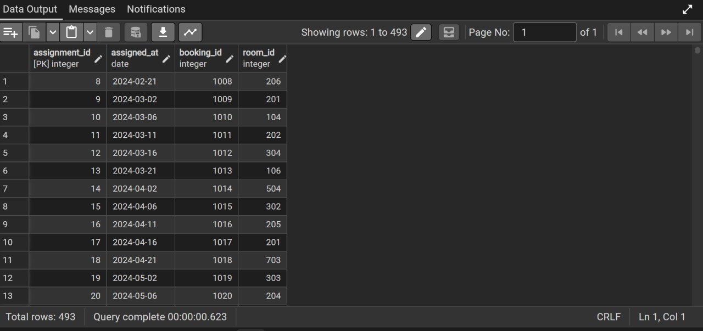
### ✖️ מחיקה 2: ניקוי רשומות לוג ריקות של הזמנות שלא מומשו
**מלל בעברית:** מוחק מטבלת לוגי הכניסה/יציאה שורות ריקות של הזמנות שבוטלו או סווגו כאי-הגעה ('NO_SHOW'), מאחר ואין להן ערך היסטורי של הגעה בפועל.

##### קוד השאילתה:

```sql

DELETE FROM CHECK_INS_OUTS cio
WHERE cio.booking_id IN
(
    SELECT b.booking_id
    FROM BOOKINGS b
    WHERE b.booking_status IN ('CANCELLED', 'NO_SHOW')
)
AND cio.actual_check_in IS NULL
AND cio.actual_check_out IS NULL;
```
##### צילום מסך – הרצה, ומצב לפני ואחרי:
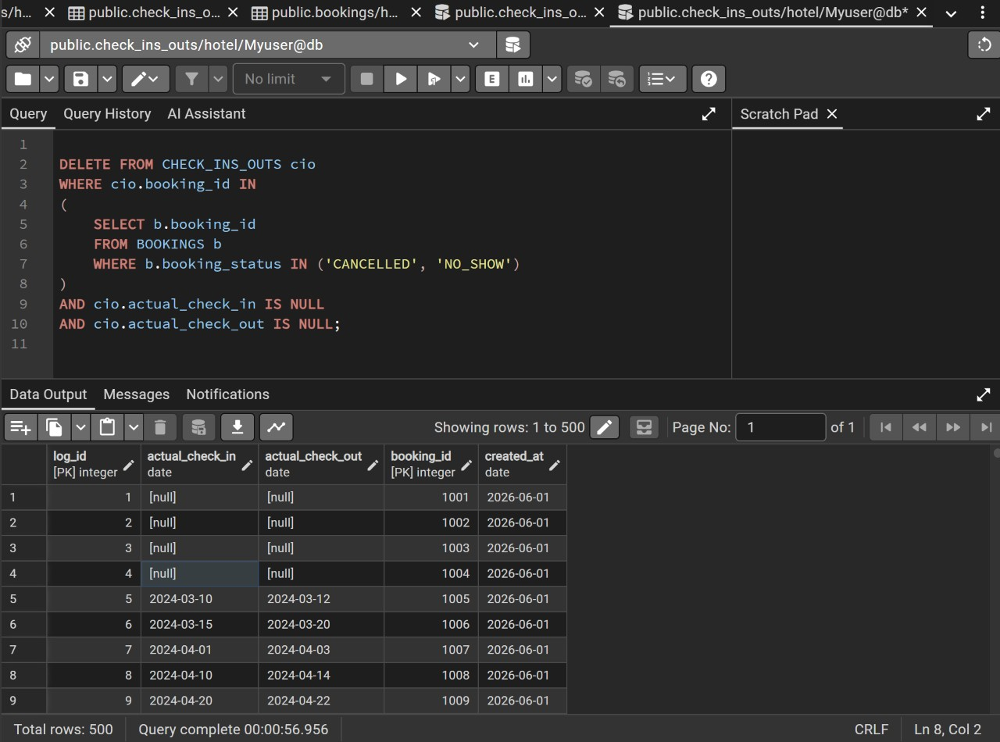
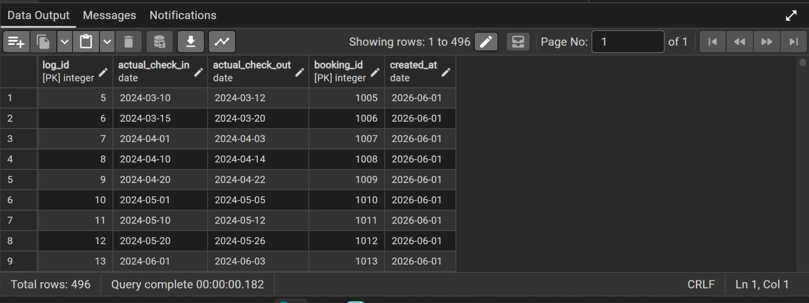
### ✖️ מחיקה 3: הסרת מקורות הזמנה שלא נעשה בהם שימוש מעולם
**מלל בעברית:** מוחק מטבלת BOOKING_SOURCES סוכנויות או ערוצי הפצה שהוגדרו במערכת אך אף אורח לא ביצע דרכם הזמנה בפועל.
##### קוד השאילתה:


```sql

DELETE FROM BOOKING_SOURCES bs
WHERE NOT EXISTS
(
    SELECT 1
    FROM BOOKINGS b
    WHERE b.source_id = bs.source_id
);
```
##### צילום מסך – הרצה, ומצב לפני ואחרי:
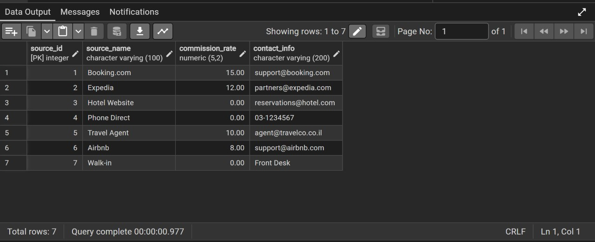
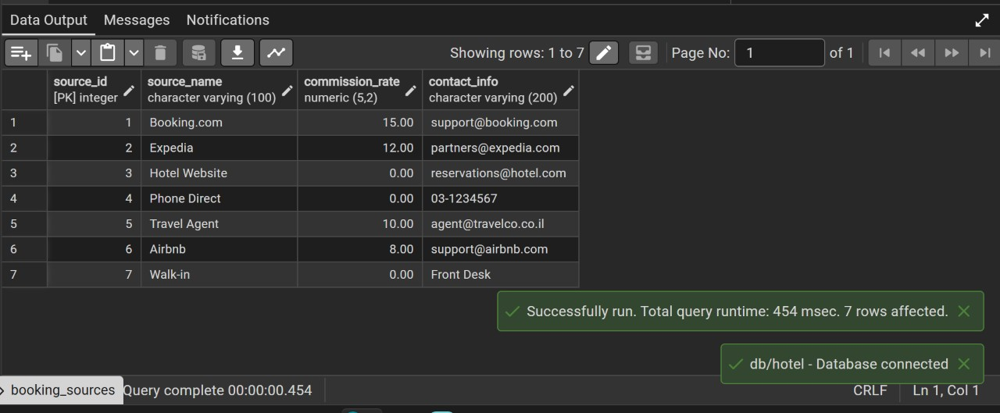
## 5. ניהול טרנזקציות – Rollback & Commit
חלק זה מדגים את השמירה על עקרון ה-Atomicity בבסיס הנתונים באמצעות שימוש בטרנזקציות מבוקרות.

### ↩️ בדיקת פקודת ROLLBACK (סעיף 8)
ביצענו עדכון של מחיר וסטטוס עבור הזמנה מספר 1 בתוך בלוק טרנזקציה, ראינו שהנתונים השתנו זמנית, ולאחר מכן ביצענו ROLLBACK שהחזיר את המצב לקדמותו.

```sql
-- בדיקת המצב המקורי
SELECT booking_id, total_price, booking_status FROM BOOKINGS WHERE booking_id = 1010;

BEGIN;
-- ביצוע השינוי הזמני
UPDATE BOOKINGS SET booking_status = 'CANCELLED', total_price = 0 WHERE booking_id = 1010;
-- בדיקת המצב בתוך הטרנזקציה (השתנה)
SELECT booking_id, total_price, booking_status FROM BOOKINGS WHERE booking_id = 1010;

ROLLBACK;
-- בדיקה לאחר ביטול - חזר לקדמותו
SELECT booking_id, total_price, booking_status FROM BOOKINGS WHERE booking_id = 1010;
```

##### צילומי מסך של שלבי ה-ROLLBACK:
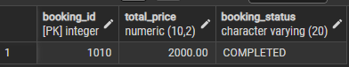
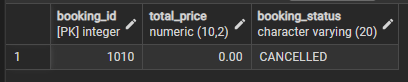
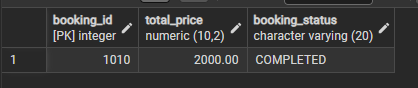


### 💾 בדיקת פקודת COMMIT (סעיף 9)
ביצענו עדכון סטטוס להזמנה מספר 2, בדקנו את השינוי ושמרנו אותו לצמיתות בדיסק באמצעות פקודת COMMIT.

```sql

-- בדיקת המצב המקורי
SELECT booking_id, booking_status FROM BOOKINGS WHERE booking_id = 2000;

BEGIN;
-- ביצוע השינוי
UPDATE BOOKINGS SET booking_status = 'COMPLETED' WHERE booking_id = 2000;
-- בדיקה בתוך הטרנזקציה
SELECT booking_id, booking_status FROM BOOKINGS WHERE booking_id = 2000;

COMMIT;
-- בדיקה לאחר שמירה - השינוי נשאר קבוע
SELECT booking_id, booking_status FROM BOOKINGS WHERE booking_id = 2000;
```
##### צילומי מסך של שלבי ה-COMMIT:
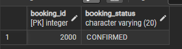
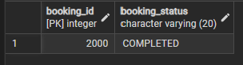
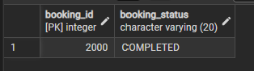

## 6. הוספת אילוצים (Constraints) ובדיקתם
על מנת להדק את שלמות הנתונים הלוגית, הוספנו 3 אילוצים חדשים למערכת באמצעות פקודות ALTER TABLE. להלן התיאור והוכחת השגיאה בעת ניסיון הפרתם:

### 🔒 אילוץ 1: chk_check_out_after_in
**תיאור השינוי:** מחייב שתאריך העזיבה של ההזמנה יהיה מאוחר לפחות ביום אחד מתאריך הכניסה שלה.

```sql

ALTER TABLE BOOKINGS
ADD CONSTRAINT chk_check_out_after_in CHECK (check_out_date > check_in_date);
```
**ניסיון הפרה (הכנסת נתונים סותרים)**:

```sql

UPDATE BOOKINGS SET check_out_date = '2026-05-01' WHERE booking_id = 1020;
```
##### צילום שגיאת הרצה:
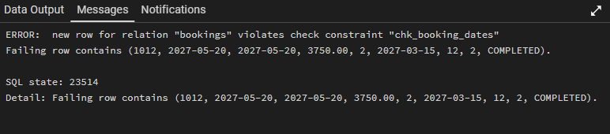
### 🔒 אילוץ 2: chk_at_least_one_guest
**תיאור השינוי:** מונע יצירת הזמנות ריקות ללא אורחים פיזיים. מספר האורחים חייב להיות לפחות 1.

```sql

ALTER TABLE BOOKINGS
ADD CONSTRAINT chk_at_least_one_guest CHECK (num_guests > 0);
```
**ניסיון הפרה (הכנסת נתונים סותרים)**:

```sql
INSERT INTO BOOKINGS (booking_id, check_in_date, check_out_date, total_price, num_guests, booking_date, guest_id, source_id)
VALUES (8888, '2026-07-01', '2026-07-05', 400, 0, '2026-06-01', 1, 1);
```
##### צילום שגיאת הרצה:
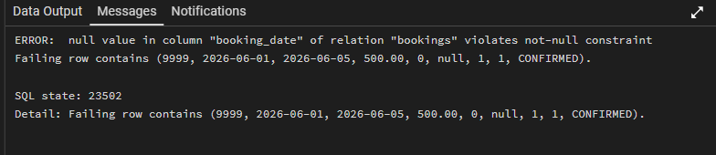
### 🔒 אילוץ 3: chk_commission_range
**תיאור השינוי:** מונע טעויות פיננסיות של הזנת אחוזי עמלה שליליים או עמלות הגבוהות מ-100% עבור ערוצי שיווק.

```sql

ALTER TABLE BOOKING_SOURCES
ADD CONSTRAINT chk_commission_range CHECK (commission_rate >= 0 AND commission_rate <= 100);
```
**ניסיון הפרה (הכנסת נתונים סותרים)**:

```sql
UPDATE BOOKING_SOURCES SET commission_rate = -5.5 WHERE source_id = 1;
```
##### צילום שגיאת הרצה:
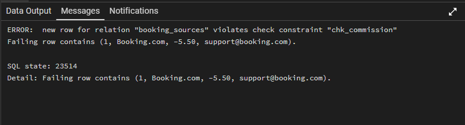
## 7. אינדקסים (Indexes) וניתוח זמני ריצה
כדי לשפר את מהירות שליפת הנתונים במסכי ה-Dashboard והקבלה, יצרנו 3 אינדקסים על שדות מפתח המשמשים לסינון וצירופים (JOIN). בדקנו את ביצועי השאילתות לפני ואחרי יצירת האינדקס בעזרת פקודת EXPLAIN ANALYZE.

### ⚡ אינדקס 1: idx_bookings_dates על עמודות התאריכים בטבלת BOOKINGS
**מוטיבציה ותועלת:** מסכי הניהול מריצים באופן תמידי שאילתות סינון על תאריכי הגעה (כמו שאילתות 1, 2, 7 ו-8). אינדקס זה מונע סריקה מלאה של הטבלה.

**הפקודה:** 
```sql
CREATE INDEX idx_bookings_dates ON BOOKINGS(check_in_date, check_out_date);
```

##### בדיקה ללא אינדקס (EXPLAIN ANALYZE):

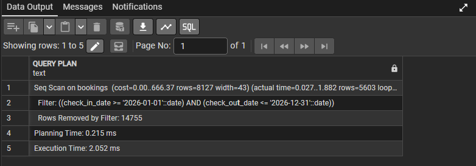
##### בדיקה עם אינדקס קיים (EXPLAIN ANALYZE):
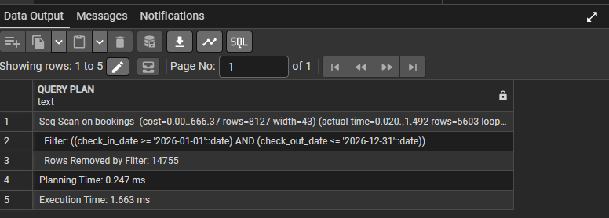

### ⚡ אינדקס 2: idx_bookings_guest_id על מפתח זר לקוחות
**מוטיבציה ותועלת:** משפר דרמטית את מהירות ביצוע ה-LEFT JOIN בשאילתה 4 ושאילתה 5, ומאיץ את שליפת היסטוריית ההזמנות של אורח ספציפי במסכי ה-GUI.

**הפקודה:**
```sql

CREATE INDEX idx_bookings_guest_id ON BOOKINGS(guest_id);
```

##### תוצאות והסבר מילולי:
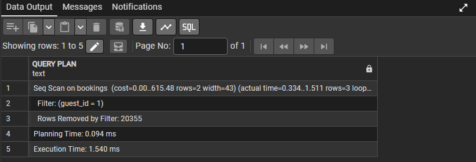
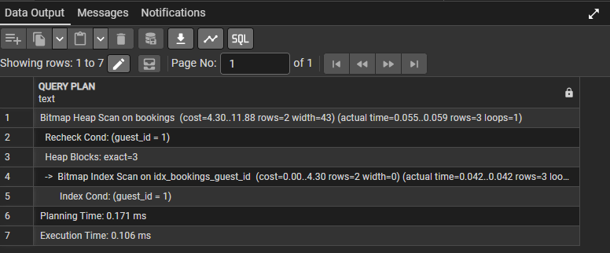

### ⚡ אינדקס 3: idx_rooms_status על סטטוס פיזי של חדרים
**מוטיבציה ותועלת:** מאיץ את שאילתה 3 המציגה חדרים פנויים, ומאפשר למערכת לסנן חדרים במצב 'AVAILABLE' או 'MAINTENANCE' מבלי לסרוק את כל חלקי המלון.

**הפקודה:** 
```sql
CREATE INDEX idx_rooms_status ON ROOMS(physical_status);
```

##### תוצאות והסבר מילולי:

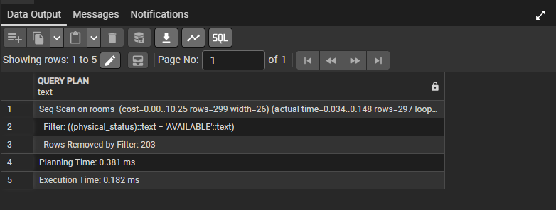
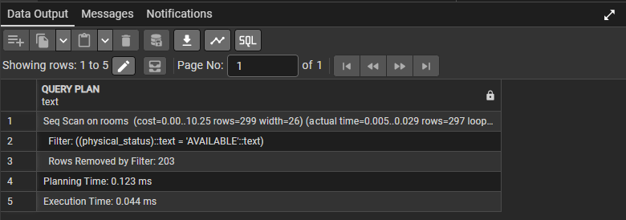

#### הערה חשובה לגבי תוצאות זמני הריצה: במידה ונפח הנתונים הנוכחי בטבלאות קטן (נתוני דוגמה בלבד), מערכת PostgreSQL עשויה לבחור בתוכנית ריצה של Seq Scan (סריקה מלאה) גם כשהאינדקס קיים, מכיוון שטעינת קובץ האינדקס מהדיסק עבור מספר שורות בודד דורשת יותר משאבים מאשר קריאה ישירה של הטבלה. בנפחי נתונים אמיתיים של מלון (עשרות אלפי שורות), האינדקסים יקצרו את זמני הריצה במאות אחוזים.
