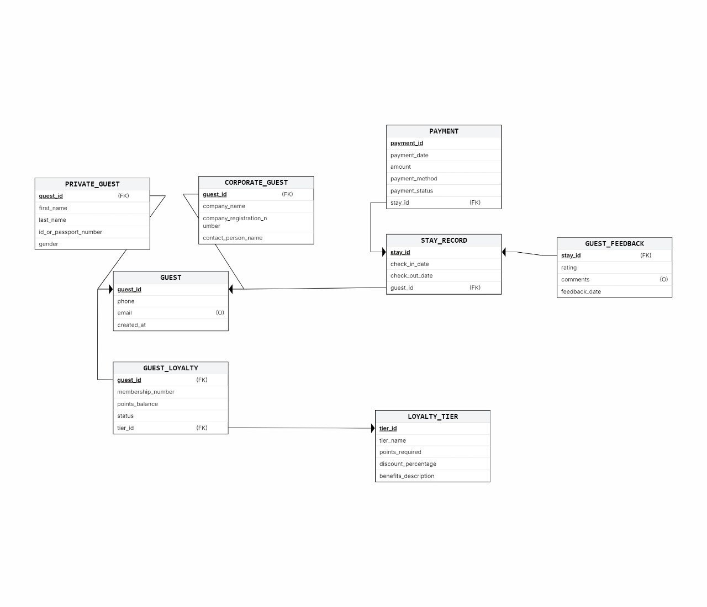
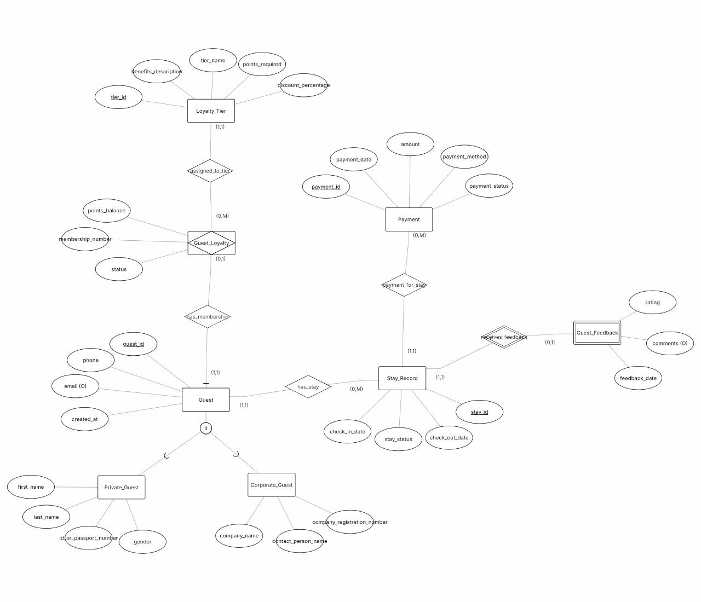
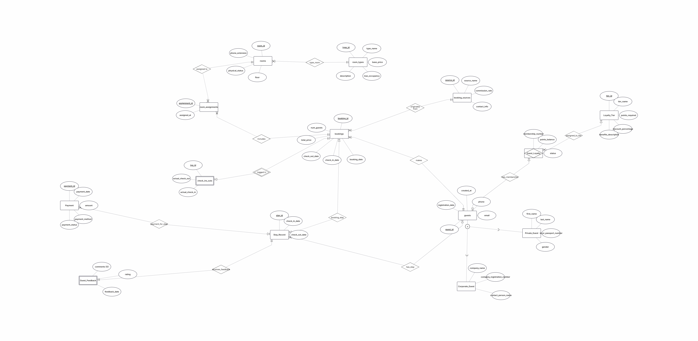
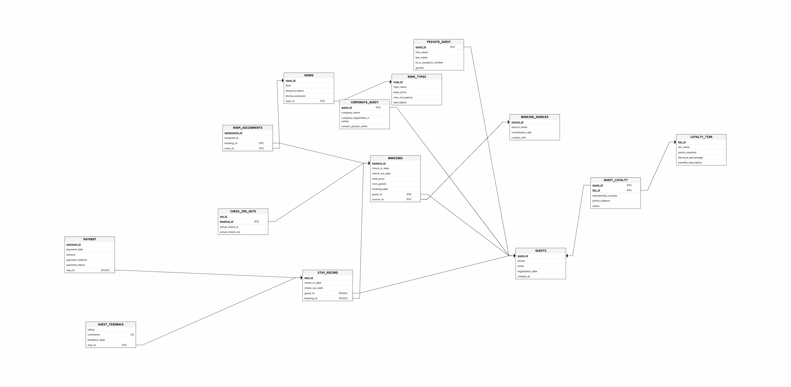
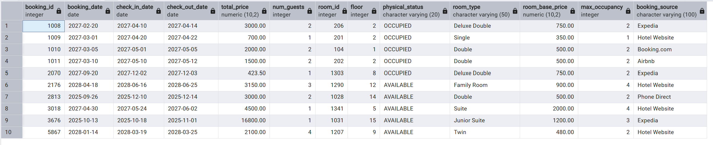
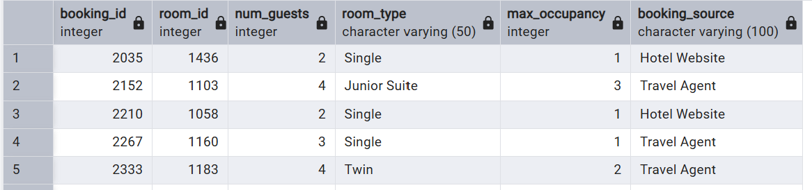
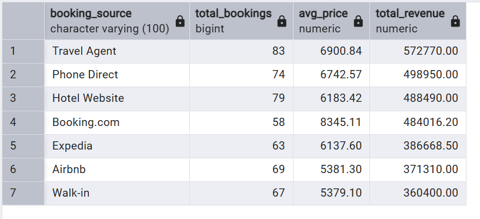
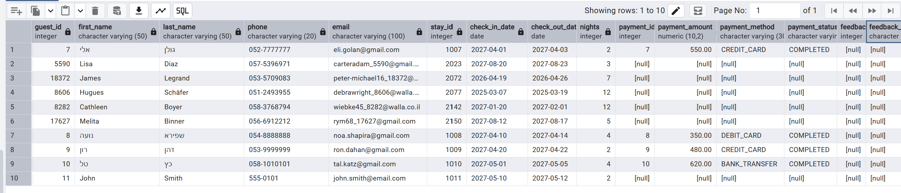
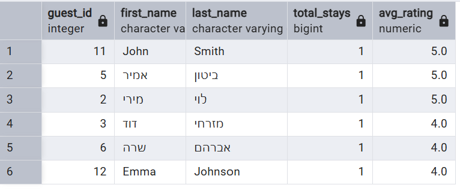
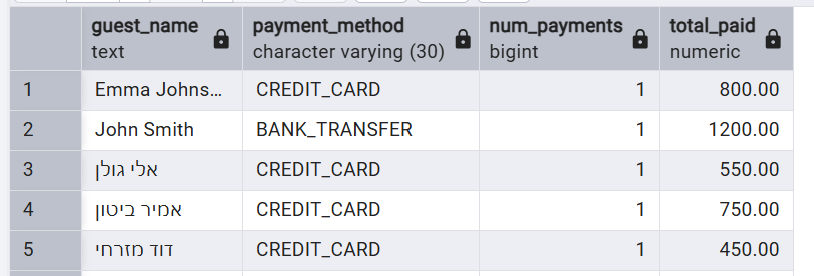

# 📘 דוח הפרויקט – שלב ג': אינטגרציה ומבטים

חלק זה מתעד את תהליך האינטגרציה של שני בסיסי נתונים לבסיס נתונים משולב אחד. האגף המקורי שלנו מנהל חדרים והזמנות במלון, והאגף שקיבלנו מנהל אורחים (פרטיים/עסקיים), שהיות, תשלומים, פידבק ותוכנית נאמנות. לאחר האינטגרציה, יצרנו 2 מבטים (Views) עם 2 שאילתות לכל מבט.

---

## 📑 תוכן עניינים – שלב ג'

1. [תיאור התהליך](#1-תיאור-התהליך)
2. [אלגוריתם הינדוס לאחור (Reverse Engineering)](#2-אלגוריתם-הינדוס-לאחור-reverse-engineering)
3. [תרשימים](#3-תרשימים)
4. [החלטות אינטגרציה](#4-החלטות-אינטגרציה)
5. [הסבר פקודות](#5-הסבר-פקודות)
6. [מבט 1: v_booking_room_details (אגף החדרים וההזמנות)](#6-מבט-1-v_booking_room_details-אגף-החדרים-וההזמנות)
7. [מבט 2: v_guest_stay_summary (אגף האורחים)](#7-מבט-2-v_guest_stay_summary-אגף-האורחים)

---

## 1. תיאור התהליך

**האגף המקורי שלנו** מנהל חדרים והזמנות במלון וכולל 7 טבלאות:

<div dir="rtl">
- `GUESTS` – אורחים
- `BOOKINGS` – הזמנות
- `ROOMS` / `ROOM_TYPES` – חדרים וסוגי חדרים
- `ROOM_ASSIGNMENTS` – שיבוץ חדרים להזמנות
- `CHECK_INS_OUTS` – לוג צ'ק-אין/צ'ק-אאוט בפועל
- `BOOKING_SOURCES` – מקורות הזמנה (אתרים, סוכנויות)
</div>
**האגף שקיבלנו** מנהל אורחים עם מערכת נאמנות וכולל 8 טבלאות:
<div dir="rtl">
- `GUEST` – אורח (טבלת אב לירושה)
- `PRIVATE_GUEST` – אורח פרטי (ירושה)
- `CORPORATE_GUEST` – אורח עסקי (ירושה)
- `STAY_RECORD` – רשומת שהייה
- `PAYMENT` – תשלומים
- `GUEST_FEEDBACK` – פידבק על שהייה
- `GUEST_LOYALTY` – מנוי נאמנות
- `LOYALTY_TIER` – דרגות נאמנות
</div>
---

## 2. אלגוריתם הינדוס לאחור (Reverse Engineering)

תהליך ההינדוס לאחור שביצענו כדי לקבל ERD מתוך הגיבוי (DSD) של האגף שקיבלנו:

### שלב 1: זיהוי טבלאות
סקרנו את קובץ הגיבוי וזיהינו 8 טבלאות: `GUEST`, `PRIVATE_GUEST`, `CORPORATE_GUEST`, `STAY_RECORD`, `PAYMENT`, `GUEST_FEEDBACK`, `GUEST_LOYALTY`, `LOYALTY_TIER`.

### שלב 2: זיהוי מפתחות ראשיים (PK)
לכל טבלה זיהינו את המפתח הראשי:
<div dir="rtl">

| טבלה | PK |
|------|-----|
| GUEST | guest_id |
| PRIVATE_GUEST | guest_id (FK+PK) |
| CORPORATE_GUEST | guest_id (FK+PK) |
| STAY_RECORD | stay_id |
| PAYMENT | payment_id |
| GUEST_FEEDBACK | stay_id (FK+PK) |
| GUEST_LOYALTY | guest_id (FK+PK) |
| LOYALTY_TIER | tier_id |
</div>

### שלב 3: זיהוי מפתחות זרים (FK)
- `guest_id` ב-`PRIVATE_GUEST` ו-`CORPORATE_GUEST` → מצביע ל-`GUEST`
- `stay_id` ב-`PAYMENT` ו-`GUEST_FEEDBACK` → מצביע ל-`STAY_RECORD`
- `guest_id` ב-`STAY_RECORD` → מצביע ל-`GUEST`
- `tier_id` ב-`GUEST_LOYALTY` → מצביע ל-`LOYALTY_TIER`

### שלב 4: זיהוי ירושה
`PRIVATE_GUEST` ו-`CORPORATE_GUEST` חולקות PK עם `GUEST` ויש להן FK אליו → **זו ירושה disjoint** (כל אורח הוא פרטי **או** עסקי, לא שניהם).

### שלב 5: קביעת cardinality
<div dir="rtl">


| טבלאות | יחס | הסבר |
|--------|------|-------|
| GUEST → STAY_RECORD | 1:N | אורח יכול לשהות כמה פעמים |
| STAY_RECORD → PAYMENT | 1:N | לשהייה יכולים להיות כמה תשלומים |
| STAY_RECORD → GUEST_FEEDBACK | 1:1 | לשהייה פידבק אחד (אופציונלי) |
| GUEST → GUEST_LOYALTY | 1:1 | לאורח מנוי נאמנות אחד (אופציונלי) |
| GUEST_LOYALTY → LOYALTY_TIER | N:1 | מנויים רבים באותה דרגה |
</div>

### שלב 6: בניית ה-ERD
על בסיס הנתונים שאספנו בנינו את ה-ERD ב-ERDPlus.

---

## 3. תרשימים

### 🖼️ DSD של האגף החדש (שקיבלנו)


### 🖼️ ERD של האגף החדש (שקיבלנו)


### 🖼️ ERD משותף (לאחר אינטגרציה)


### 🖼️ DSD לאחר אינטגרציה


---

## 4. החלטות אינטגרציה

### 🔹 החלטה 1 – טבלת GUESTS
החלטנו **להשאיר** את השדות `first_name`, `last_name`, `passport_number` בטבלת `GUESTS` המקורית ולא למחוק אותם, למרות שהם קיימים גם ב-`PRIVATE_GUEST`.

**הסיבה:** השאילתות משלב ב' משתמשות בשדות אלה ישירות מ-`GUESTS` (לדוגמה: `g.first_name || ' ' || g.last_name`). לפי ההנחיות (סעיף 7), השאילתות חייבות להמשיך לעבוד על בסיס הנתונים המשולב. הוספנו עמודת `created_at` ל-`GUESTS`.

### 🔹 החלטה 2 – BOOKINGS מול STAY_RECORD
אלו **שני מושגים שונים**: `BOOKINGS` = הזמנה (לפני הגעה), `STAY_RECORD` = שהייה בפועל. שמרנו את שתי הטבלאות עם קשר ביניהן (`booking_id` ב-`STAY_RECORD`). כך ניתן לעקוב אחרי הזמנות שטרם מומשו לשהייה.

### 🔹 החלטה 3 – ירושה
הוספנו `PRIVATE_GUEST` ו-`CORPORATE_GUEST` כטבלאות ירושה מ-`GUESTS`. כל האורחים הקיימים (20,999) הועתקו ל-`PRIVATE_GUEST` כאורחים פרטיים.

### 🔹 החלטה 4 – נתונים
- הנתונים הקיימים שלנו נשמרו כמות שהם (20,999 אורחים, 20,360 הזמנות).
- נתוני `STAY_RECORD` נוצרו אוטומטית מתוך `BOOKINGS` (שהייה לכל הזמנה).
- נוספו 2 אורחים עסקיים חדשים להדגמת `CORPORATE_GUEST`.
- הוכנסו נתוני דוגמה לכל הטבלאות החדשות (תשלומים, פידבק, נאמנות).

---

## 5. הסבר פקודות

### 🔧 שינוי טבלה קיימת (ALTER TABLE)

```sql
ALTER TABLE GUESTS ADD COLUMN created_at DATE;
```
הוספת עמודת תאריך יצירה לטבלת אורחים, כדי להתאים לסכמה של האגף שקיבלנו.

### 🔧 יצירת טבלאות חדשות (CREATE TABLE)
<div dir="rtl">

| פקודה | תיאור |
|-------|--------|
| `CREATE TABLE PRIVATE_GUEST` | טבלת אורח פרטי עם FK ל-GUESTS (ירושה) |
| `CREATE TABLE CORPORATE_GUEST` | טבלת אורח עסקי עם FK ל-GUESTS (ירושה) |
| `CREATE TABLE LOYALTY_TIER` | טבלת דרגות נאמנות (Bronze, Silver, Gold, Platinum) |
| `CREATE TABLE GUEST_LOYALTY` | טבלת מנויי נאמנות עם FK ל-GUESTS ול-LOYALTY_TIER |
| `CREATE TABLE STAY_RECORD` | טבלת שהיות עם FK ל-GUESTS ול-BOOKINGS |
| `CREATE TABLE PAYMENT` | טבלת תשלומים עם FK ל-STAY_RECORD |
| `CREATE TABLE GUEST_FEEDBACK` | טבלת פידבק עם PK+FK ל-STAY_RECORD |
</div>

### 🔧 העתקת נתונים

```sql
-- העתקת אורחים קיימים ל-PRIVATE_GUEST
INSERT INTO PRIVATE_GUEST (guest_id, first_name, last_name, id_or_passport_number, gender)
SELECT guest_id, first_name, last_name, passport_number, NULL
FROM GUESTS;

-- יצירת STAY_RECORD מתוך ההזמנות הקיימות
INSERT INTO STAY_RECORD (stay_id, check_in_date, check_out_date, guest_id, booking_id)
SELECT b.booking_id, b.check_in_date, b.check_out_date, b.guest_id, b.booking_id
FROM BOOKINGS b;
```

---

## 6. מבט 1: v_booking_room_details (אגף החדרים וההזמנות)

**תיאור:** מבט שמשלב 4 טבלאות: `BOOKINGS`, `ROOM_ASSIGNMENTS`, `ROOMS`, `ROOM_TYPES` ו-`BOOKING_SOURCES`. מציג לכל הזמנה את פרטי החדר שהוקצה לה: מספר חדר, קומה, סוג חדר, מחיר בסיס ומקור ההזמנה.

```sql
CREATE OR REPLACE VIEW v_booking_room_details AS
SELECT
    b.booking_id, b.booking_date, b.check_in_date, b.check_out_date,
    b.total_price, b.num_guests,
    r.room_id, r.floor, r.physical_status,
    rt.type_name AS room_type, rt.base_price AS room_base_price, rt.max_occupancy,
    bs.source_name AS booking_source
FROM BOOKINGS b
JOIN ROOM_ASSIGNMENTS ra ON b.booking_id = ra.booking_id
JOIN ROOMS r ON ra.room_id = r.room_id
JOIN ROOM_TYPES rt ON r.type_id = rt.type_id
JOIN BOOKING_SOURCES bs ON b.source_id = bs.source_id;
```

##### שליפת נתונים מהמבט (SELECT * LIMIT 10):


---

### 📊 שאילתה 1.1 – הזמנות עם חריגת תפוסה

**תיאור:** מציגה הזמנות שבהן מספר האורחים חורג מהתפוסה המקסימלית של החדר שהוקצה. **מטרה:** לזהות הזמנות בעייתיות שבהן הוקצה חדר קטן מדי.

```sql
SELECT booking_id, room_id, num_guests, room_type, max_occupancy, booking_source
FROM v_booking_room_details
WHERE num_guests > max_occupancy
ORDER BY booking_id;
```

##### צילום הרצה ותוצאה:


---

### 📊 שאילתה 1.2 – הכנסה לפי מקור הזמנה

**תיאור:** מציגה סיכום הכנסות לפי ערוץ הזמנה: כמה הזמנות, מחיר ממוצע וסך הכנסות. **מטרה:** להבין איזה ערוץ הזמנה מביא את ההכנסה הגבוהה ביותר.

```sql
SELECT booking_source, COUNT(*) AS total_bookings,
       ROUND(AVG(total_price), 2) AS avg_price,
       SUM(total_price) AS total_revenue
FROM v_booking_room_details
GROUP BY booking_source
ORDER BY total_revenue DESC;
```

##### צילום הרצה ותוצאה:


---

## 7. מבט 2: v_guest_stay_summary (אגף האורחים)

**תיאור:** מבט שמשלב 4 טבלאות: `GUESTS`, `STAY_RECORD`, `PAYMENT` ו-`GUEST_FEEDBACK`. מציג לכל אורח את שהיותיו במלון, סכומי התשלום, שיטת תשלום ודירוג הפידבק.

```sql
CREATE OR REPLACE VIEW v_guest_stay_summary AS
SELECT
    g.guest_id, g.first_name, g.last_name, g.phone, g.email,
    sr.stay_id, sr.check_in_date, sr.check_out_date,
    (sr.check_out_date - sr.check_in_date) AS nights,
    p.payment_id, p.amount AS payment_amount, p.payment_method, p.payment_status,
    gf.rating AS feedback_rating, gf.comments AS feedback_comments
FROM GUESTS g
JOIN STAY_RECORD sr ON g.guest_id = sr.guest_id
LEFT JOIN PAYMENT p ON sr.stay_id = p.stay_id
LEFT JOIN GUEST_FEEDBACK gf ON sr.stay_id = gf.stay_id;
```

##### שליפת נתונים מהמבט (SELECT * LIMIT 10):


---

### 📊 שאילתה 2.1 – אורחים מרוצים (דירוג 4+)

**תיאור:** מציגה אורחים עם דירוג ממוצע 4 ומעלה. **מטרה:** לזהות אורחים מרוצים שאפשר להציע להם מנוי נאמנות.

```sql
SELECT guest_id, first_name, last_name,
       COUNT(stay_id) AS total_stays,
       ROUND(AVG(feedback_rating), 1) AS avg_rating
FROM v_guest_stay_summary
WHERE feedback_rating IS NOT NULL
GROUP BY guest_id, first_name, last_name
HAVING AVG(feedback_rating) >= 4
ORDER BY avg_rating DESC;
```

##### צילום הרצה ותוצאה:


---

### 📊 שאילתה 2.2 – סיכום תשלומים לפי אורח ושיטת תשלום

**תיאור:** מציגה לכל אורח את שיטת התשלום המועדפת וסך ההוצאות. **מטרה:** להבין העדפות תשלום של אורחים.

```sql
SELECT first_name || ' ' || last_name AS guest_name,
       payment_method, COUNT(*) AS num_payments,
       SUM(payment_amount) AS total_paid
FROM v_guest_stay_summary
WHERE payment_amount IS NOT NULL
GROUP BY first_name, last_name, payment_method
ORDER BY guest_name, total_paid DESC;
```

##### צילום הרצה ותוצאה:

