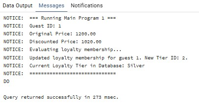
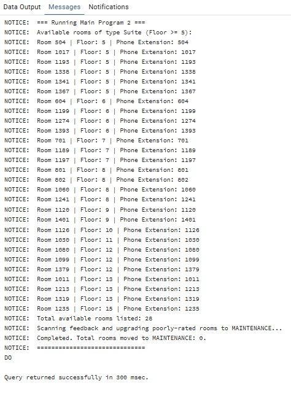

# 📘 דוח הפרויקט – שלב ד': תכנות ב-PL/pgSQL

חלק זה מתעד את פיתוח תוכניות בסיס הנתונים (פונקציות, פרוצדורות, וטריגרים) בשפת PL/pgSQL על גבי בסיס הנתונים המשולב.

---

## 📑 תוכן עניינים – שלב ד'

1. [שינויי מבנה (AlterTable.sql)](#1-שינויי-מבנה-altertablesql)
2. [פונקציות (Functions)](#2-פונקציות-functions)
   - [פונקציה 1: fn_calculate_guest_discount](#פונקציה-1-fn_calculate_guest_discount)
   - [פונקציה 2: fn_get_available_rooms_by_type](#פונקציה-2-fn_get_available_rooms_by_type)
3. [פרוצדורות (Procedures)](#3-פרוצדורות-procedures)
   - [פרוצדורה 1: pr_register_loyalty_member](#פרוצדורה-1-pr_register_loyalty_member)
   - [פרוצדורה 2: pr_upgrade_room_status](#פרוצדורה-2-pr_upgrade_room_status)
4. [טריגרים (Triggers)](#4-טריגרים-triggers)
   - [טריגר 1: trg_update_loyalty_points](#טריגר-1-trg_update_loyalty_points)
   - [טריגר 2: trg_prevent_double_booking](#טריגר-2-trg_prevent_double_booking)
5. [תוכניות ראשיות והוכחות הרצה](#5-תוכניות-ראשיות-והוכחות-הרצה)
   - [תוכנית ראשית 1: main_program_1.sql](#תוכנית-ראשית-1-main_program_1sql)
   - [תוכנית ראשית 2: main_program_2.sql](#תוכנית-ראשית-2-main_program_2sql)

---

## 1. שינויי מבנה (AlterTable.sql)

**תיאור מילולי:**
כדי לנהל רישום של חדרים שיצאו משימוש לצורך תחזוקה, יצרנו טבלת לוג ייעודית בשם `ROOM_MAINTENANCE_LOG`. טבלה זו מקושרת לטבלת `ROOMS` ותתעד מתי חדר הושבת, ומהי סיבת ההשבתה (למשל, פידבק שלילי מאורח).

**קוד הפקודה:**
```sql
CREATE TABLE IF NOT EXISTS ROOM_MAINTENANCE_LOG
(
    log_id             SERIAL PRIMARY KEY,
    room_id            INT NOT NULL,
    maintenance_date   TIMESTAMP NOT NULL DEFAULT CURRENT_TIMESTAMP,
    reason             VARCHAR(300),
    FOREIGN KEY (room_id) REFERENCES ROOMS(room_id) ON DELETE CASCADE
);
```

---

## 2. פונקציות (Functions)

### פונקציה 1: fn_calculate_guest_discount
* **תיאור מילולי:** הפונקציה מקבלת מזהה אורח ומחיר בסיסי של הזמנה, ומחשבת את המחיר הסופי לאחר הנחות.
* **מנגנונים בשימוש:** אילוץ בדיקת קיום אורח (זריקת שגיאה במידה ולא קיים), שליפה מרובה עם מפתח זר (`Implicit Query`), ושימוש ב-**Explicit Cursor** שעובר על היסטוריית הפידבקים של האורח. במידה ודירוג הפידבק של שהייה קודמת היה נמוך מ-3, האורח מקבל 10% הנחת פיצוי נוספת על אחוז הנחת המועדון הרגיל שלו (מוגבל עד ל-50% הנחה מקסימלית).
* **קוד הפונקציה:**
```sql
CREATE OR REPLACE FUNCTION fn_calculate_guest_discount(
    p_guest_id INT,
    p_booking_price NUMERIC
)
RETURNS NUMERIC AS $$
DECLARE
    v_base_discount NUMERIC := 0.00;
    v_comp_discount NUMERIC := 0.00;
    v_total_discount NUMERIC := 0.00;
    v_guest_exists INT;
    
    cur_feedbacks CURSOR FOR
        SELECT gf.rating 
        FROM GUEST_FEEDBACK gf
        JOIN STAY_RECORD sr ON gf.stay_id = sr.stay_id
        WHERE sr.guest_id = p_guest_id;
        
    r_feedback RECORD;
BEGIN
    SELECT 1 INTO v_guest_exists FROM GUESTS WHERE guest_id = p_guest_id;
    IF NOT FOUND THEN
        RAISE EXCEPTION 'Guest with ID % does not exist.', p_guest_id;
    END IF;

    SELECT lt.discount_percentage INTO v_base_discount
    FROM GUEST_LOYALTY gl
    JOIN LOYALTY_TIER lt ON gl.tier_id = lt.tier_id
    WHERE gl.guest_id = p_guest_id AND gl.status = 'ACTIVE';

    IF v_base_discount IS NULL THEN
        v_base_discount := 0.00;
    END IF;

    OPEN cur_feedbacks;
    LOOP
        FETCH cur_feedbacks INTO r_feedback;
        EXIT WHEN NOT FOUND;
        
        IF r_feedback.rating <= 2 THEN
            v_comp_discount := 10.00;
        END IF;
    END LOOP;
    CLOSE cur_feedbacks;

    v_total_discount := v_base_discount + v_comp_discount;
    
    IF v_total_discount > 50.00 THEN
        v_total_discount := 50.00;
    END IF;

    RETURN ROUND(p_booking_price * (1 - v_total_discount / 100), 2);
EXCEPTION
    WHEN OTHERS THEN
        RAISE NOTICE 'Error in fn_calculate_guest_discount: %', SQLERRM;
        RAISE;
END;
$$ LANGUAGE plpgsql;
```

### פונקציה 2: fn_get_available_rooms_by_type
* **תיאור מילולי:** פונקציה המאפשרת לאחזר חדרים פנויים מסוג מסוים שנמצאים מעל קומה מוגדרת.
* **מנגנונים בשימוש:** פתיחת **Ref Cursor** דינמי והחזרתו לתוכנית המזמנת. כולל מנגנון בדיקת קיום סוג חדר וזריקת שגיאה במקרה של ערך שאינו קיים.
* **קוד הפונקציה:**
```sql
CREATE OR REPLACE FUNCTION fn_get_available_rooms_by_type(
    p_type_name VARCHAR,
    p_min_floor INT,
    p_cursor_name refcursor
)
RETURNS refcursor AS $$
DECLARE
    v_type_exists INT;
BEGIN
    SELECT 1 INTO v_type_exists FROM ROOM_TYPES WHERE type_name = p_type_name;
    IF NOT FOUND THEN
        RAISE EXCEPTION 'Room type % does not exist.', p_type_name;
    END IF;

    OPEN p_cursor_name FOR
        SELECT r.room_id, r.floor, r.phone_extension
        FROM ROOMS r
        JOIN ROOM_TYPES rt ON r.type_id = rt.type_id
        WHERE rt.type_name = p_type_name 
          AND r.physical_status = 'AVAILABLE'
          AND r.floor >= p_min_floor
        ORDER BY r.floor, r.room_id;

    RETURN p_cursor_name;
EXCEPTION
    WHEN OTHERS THEN
        RAISE NOTICE 'Error in fn_get_available_rooms_by_type: %', SQLERRM;
        RAISE;
END;
$$ LANGUAGE plpgsql;
```

---

## 3. פרוצדורות (Procedures)

### פרוצדורה 1: pr_register_loyalty_member
* **תיאור מילולי:** רושמת אורח למועדון הלקוחות או משדרגת את דרגת הנאמנות שלו.
* **מנגנונים בשימוש:** ביצוע חישוב מצרפי (`SUM`) של כל הוצאות האורח בעזרת `Implicit Cursor`, הסתעפויות לקביעת הדרגה המתאימה (Bronze, Silver, Gold, Platinum), וביצוע פעולות עדכון/הוספה (`INSERT`/`UPDATE` - DML).
* **קוד הפרוצדורה:**
```sql
CREATE OR REPLACE PROCEDURE pr_register_loyalty_member(
    p_guest_id INT
)
AS $$
DECLARE
    v_total_spent NUMERIC := 0.00;
    v_tier_id INT;
    v_membership_num VARCHAR(20);
    v_guest_exists INT;
    v_loyalty_exists INT;
BEGIN
    SELECT 1 INTO v_guest_exists FROM GUESTS WHERE guest_id = p_guest_id;
    IF NOT FOUND THEN
        RAISE EXCEPTION 'Guest with ID % does not exist.', p_guest_id;
    END IF;

    SELECT COALESCE(SUM(p.amount), 0.00) INTO v_total_spent
    FROM PAYMENT p
    JOIN STAY_RECORD sr ON p.stay_id = sr.stay_id
    WHERE sr.guest_id = p_guest_id AND p.payment_status = 'COMPLETED';

    IF v_total_spent >= 5000.00 THEN
        v_tier_id := 4; -- Platinum
    ELSIF v_total_spent >= 1500.00 THEN
        v_tier_id := 3; -- Gold
    ELSIF v_total_spent >= 500.00 THEN
        v_tier_id := 2; -- Silver
    ELSE
        v_tier_id := 1; -- Bronze
    END IF;

    SELECT 1 INTO v_loyalty_exists FROM GUEST_LOYALTY WHERE guest_id = p_guest_id;
    
    IF FOUND THEN
        UPDATE GUEST_LOYALTY 
        SET tier_id = v_tier_id
        WHERE guest_id = p_guest_id;
        RAISE NOTICE 'Updated loyalty membership for guest %. New Tier ID: %.', p_guest_id, v_tier_id;
    ELSE
        v_membership_num := 'MEM-' || (10000 + p_guest_id);
        INSERT INTO GUEST_LOYALTY (guest_id, tier_id, membership_number, points_balance, status)
        VALUES (p_guest_id, v_tier_id, v_membership_num, CAST(v_total_spent / 10 AS INT), 'ACTIVE');
        RAISE NOTICE 'Registered new loyalty membership for guest %. Membership: %, Tier ID: %.', p_guest_id, v_membership_num, v_tier_id;
    END IF;
EXCEPTION
    WHEN OTHERS THEN
        RAISE NOTICE 'Failed to register/upgrade loyalty member (ID: %): %', p_guest_id, SQLERRM;
        RAISE;
END;
$$ LANGUAGE plpgsql;
```

### פרוצדורה 2: pr_upgrade_room_status
* **תיאור מילולי:** מבצעת בדיקה של כל החדרים שקיבלו ציוני פידבק נמוכים, ומעבירה את אלו שמתחת לציון הנדרש למצב "תחזוקה" (`MAINTENANCE`), תוך רישום התיעוד בטבלת הלוג החדשה.
* **מנגנונים בשימוש:** שימוש ב-**Explicit Cursor**, מעבר בלולאה על רשומות, פקודות עדכון והוספה של לוגים (DML), ובדיקות תקינות קלט.
* **קוד הפרוצדורה:**
```sql
CREATE OR REPLACE PROCEDURE pr_upgrade_room_status(
    p_min_rating INT
)
AS $$
DECLARE
    cur_poor_rooms CURSOR FOR
        SELECT DISTINCT ra.room_id, gf.rating, gf.comments
        FROM GUEST_FEEDBACK gf
        JOIN STAY_RECORD sr ON gf.stay_id = sr.stay_id
        JOIN ROOM_ASSIGNMENTS ra ON sr.booking_id = ra.booking_id
        JOIN ROOMS r ON ra.room_id = r.room_id
        WHERE gf.rating <= p_min_rating 
          AND r.physical_status != 'MAINTENANCE';

    r_room RECORD;
    v_updated_count INT := 0;
BEGIN
    IF p_min_rating NOT BETWEEN 1 AND 5 THEN
        RAISE EXCEPTION 'Invalid rating %. Rating must be between 1 and 5.', p_min_rating;
    END IF;

    OPEN cur_poor_rooms;
    LOOP
        FETCH cur_poor_rooms INTO r_room;
        EXIT WHEN NOT FOUND;

        UPDATE ROOMS 
        SET physical_status = 'MAINTENANCE'
        WHERE room_id = r_room.room_id;

        INSERT INTO ROOM_MAINTENANCE_LOG (room_id, reason)
        VALUES (r_room.room_id, 'Feedback rating was too low: ' || r_room.rating || '. Comments: ' || COALESCE(r_room.comments, 'None'));

        v_updated_count := v_updated_count + 1;
        RAISE NOTICE 'Room % has been put to MAINTENANCE due to rating %.', r_room.room_id, r_room.rating;
    END LOOP;
    CLOSE cur_poor_rooms;

    RAISE NOTICE 'Completed. Total rooms moved to MAINTENANCE: %.', v_updated_count;
EXCEPTION
    WHEN OTHERS THEN
        RAISE NOTICE 'Error in pr_upgrade_room_status: %', SQLERRM;
        RAISE;
END;
$$ LANGUAGE plpgsql;
```

---

## 4. טריגרים (Triggers)

### טריגר 1: trg_update_loyalty_points
* **תיאור מילולי:** כאשר מעדכנים תשלום של שהייה לסטטוס 'COMPLETED', הטריגר מעדכן אוטומטית את נקודות הנאמנות של האורח, ובודק אם הוא זכאי לשדרוג רמת חברות (למשל מ-Silver ל-Gold).
* **מנגנון הטריגר:** `AFTER UPDATE OF payment_status ON PAYMENT`
* **קוד הטריגר:**
```sql
CREATE OR REPLACE FUNCTION fn_trg_update_loyalty_points()
RETURNS TRIGGER AS $$
DECLARE
    v_guest_id INT;
    v_points_to_add INT;
    v_new_points INT;
    v_new_tier_id INT;
    v_loyalty_exists INT;
BEGIN
    IF NEW.payment_status = 'COMPLETED' AND (OLD.payment_status IS NULL OR OLD.payment_status != 'COMPLETED') THEN
        SELECT guest_id INTO v_guest_id FROM STAY_RECORD WHERE stay_id = NEW.stay_id;
        
        IF FOUND THEN
            SELECT 1 INTO v_loyalty_exists FROM GUEST_LOYALTY WHERE guest_id = v_guest_id;
            
            IF FOUND THEN
                v_points_to_add := CAST(NEW.amount / 10 AS INT);
                
                UPDATE GUEST_LOYALTY
                SET points_balance = points_balance + v_points_to_add
                WHERE guest_id = v_guest_id
                RETURNING points_balance INTO v_new_points;
                
                IF v_new_points >= 5000 THEN
                    v_new_tier_id := 4; -- Platinum
                ELSIF v_new_points >= 1500 THEN
                    v_new_tier_id := 3; -- Gold
                ELSIF v_new_points >= 500 THEN
                    v_new_tier_id := 2; -- Silver
                ELSE
                    v_new_tier_id := 1; -- Bronze
                END IF;
                
                UPDATE GUEST_LOYALTY
                SET tier_id = v_new_tier_id
                WHERE guest_id = v_guest_id;
                
                RAISE NOTICE 'Trigger: Guest % received % points. New balance: %. Tier set to %.', v_guest_id, v_points_to_add, v_new_points, v_new_tier_id;
            END IF;
        END IF;
    END IF;
    RETURN NEW;
END;
$$ LANGUAGE plpgsql;

CREATE TRIGGER trg_update_loyalty_points
AFTER UPDATE OF payment_status ON PAYMENT
FOR EACH ROW
EXECUTE FUNCTION fn_trg_update_loyalty_points();
```

### טריגר 2: trg_prevent_double_booking
* **תיאור מילולי:** מונע הקצאה של חדר להזמנה אם החדר כבר תפוס בהזמנה אחרת בחופפת תאריכים, או אם החדר נמצא בסטטוס 'MAINTENANCE' או 'OUT_OF_ORDER'.
* **מנגנון הטריגר:** `BEFORE INSERT OR UPDATE ON ROOM_ASSIGNMENTS`
* **קוד הטריגר:**
```sql
CREATE OR REPLACE FUNCTION fn_trg_prevent_double_booking()
RETURNS TRIGGER AS $$
DECLARE
    v_new_check_in DATE;
    v_new_check_out DATE;
    v_room_status VARCHAR(20);
    v_overlap_booking_id INT;
BEGIN
    SELECT check_in_date, check_out_date INTO v_new_check_in, v_new_check_out
    FROM BOOKINGS
    WHERE booking_id = NEW.booking_id;

    SELECT physical_status INTO v_room_status
    FROM ROOMS
    WHERE room_id = NEW.room_id;

    IF NOT FOUND THEN
        RAISE EXCEPTION 'Room % does not exist.', NEW.room_id;
    END IF;

    IF v_room_status IN ('MAINTENANCE', 'OUT_OF_ORDER') THEN
        RAISE EXCEPTION 'Cannot assign Room %. Room physical status is %.', NEW.room_id, v_room_status;
    END IF;

    SELECT ra.booking_id INTO v_overlap_booking_id
    FROM ROOM_ASSIGNMENTS ra
    JOIN BOOKINGS b ON ra.booking_id = b.booking_id
    WHERE ra.room_id = NEW.room_id
      AND ra.booking_id != NEW.booking_id
      AND b.check_in_date < v_new_check_out
      AND b.check_out_date > v_new_check_in
    LIMIT 1;

    IF FOUND THEN
        RAISE EXCEPTION 'Cannot assign Room %: Overlaps with Booking %.', NEW.room_id, v_overlap_booking_id;
    END IF;

    RETURN NEW;
END;
$$ LANGUAGE plpgsql;

CREATE TRIGGER trg_prevent_double_booking
BEFORE INSERT OR UPDATE ON ROOM_ASSIGNMENTS
FOR EACH ROW
EXECUTE FUNCTION fn_trg_prevent_double_booking();
```

---

## 5. תוכניות ראשיות והוכחות הרצה

### תוכנית ראשית 1: main_program_1.sql
* **תיאור מילולי:** מפעילה את פונקציית ההנחות על אורח ספציפי ומדפיסה את התוצאות, ולאחר מכן מזמנת את פרוצדורת מועדון הנאמנות לצורך עדכון סך הרכישות והדרגה של האורח.

**פלט ריצה והוכחת הצלחה:**
```text
NOTICE:  === Running Main Program 1 ===
NOTICE:  Guest ID: 1
NOTICE:  Original Price: 1200.00
NOTICE:  Discounted Price: 1020.00
NOTICE:  Evaluating loyalty membership...
NOTICE:  Updated loyalty membership for guest 1. New Tier ID: 2.
NOTICE:  Current Loyalty Tier in Database: Silver
NOTICE:  ==============================
DO
```

##### צילום מסך של ההרצה ב-pgAdmin:


### תוכנית ראשית 2: main_program_2.sql
* **תיאור מילולי:** מפעילה את פונקציית החדרים הפנויים שמחזירה Ref Cursor, רצה בלולאה ומדפיסה את תוצאותיו, ולאחר מכן מזמנת את פרוצדורת השבתת החדרים לתחזוקה.

**פלט ריצה והוכחת הצלחה:**
```text
NOTICE:  === Running Main Program 2 ===
NOTICE:  Available rooms of type Suite (Floor >= 5):
NOTICE:  Room 504 | Floor: 5 | Phone Extension: 504
NOTICE:  Room 1017 | Floor: 5 | Phone Extension: 1017
NOTICE:  Room 1193 | Floor: 5 | Phone Extension: 1193
NOTICE:  Room 1338 | Floor: 5 | Phone Extension: 1338
NOTICE:  Room 1341 | Floor: 5 | Phone Extension: 1341
NOTICE:  Room 1367 | Floor: 5 | Phone Extension: 1367
NOTICE:  Room 604 | Floor: 6 | Phone Extension: 604
NOTICE:  Room 1199 | Floor: 6 | Phone Extension: 1199
NOTICE:  Room 1274 | Floor: 6 | Phone Extension: 1274
NOTICE:  Room 1393 | Floor: 6 | Phone Extension: 1393
NOTICE:  Room 701 | Floor: 7 | Phone Extension: 701
NOTICE:  Room 1189 | Floor: 7 | Phone Extension: 1189
NOTICE:  Room 1197 | Floor: 7 | Phone Extension: 1197
NOTICE:  Room 801 | Floor: 8 | Phone Extension: 801
NOTICE:  Room 802 | Floor: 8 | Phone Extension: 802
NOTICE:  Room 1060 | Floor: 8 | Phone Extension: 1060
NOTICE:  Room 1241 | Floor: 8 | Phone Extension: 1241
NOTICE:  Room 1120 | Floor: 9 | Phone Extension: 1120
NOTICE:  Room 1401 | Floor: 9 | Phone Extension: 1401
NOTICE:  Room 1126 | Floor: 10 | Phone Extension: 1126
NOTICE:  Room 1030 | Floor: 11 | Phone Extension: 1030
NOTICE:  Room 1080 | Floor: 12 | Phone Extension: 1080
NOTICE:  Room 1099 | Floor: 12 | Phone Extension: 1099
NOTICE:  Room 1379 | Floor: 12 | Phone Extension: 1379
NOTICE:  Room 1011 | Floor: 13 | Phone Extension: 1011
NOTICE:  Room 1213 | Floor: 13 | Phone Extension: 1213
NOTICE:  Room 1319 | Floor: 13 | Phone Extension: 1319
NOTICE:  Room 1235 | Floor: 15 | Phone Extension: 1235
NOTICE:  Total available rooms listed: 28
NOTICE:  Scanning feedback and upgrading poorly-rated rooms to MAINTENANCE...
DO
NOTICE:  Completed. Total rooms moved to MAINTENANCE: 0.
NOTICE:  ==============================
```

##### צילום מסך של ההרצה ב-pgAdmin:

