# שלב ה' - ממשק גרפי למערכת ניהול מלון

## Hotel Management System - GUI Application

**פרויקט מיני בבסיסי נתונים | DB5786_1663_8781**

---

## תיאור המערכת

ממשק גרפי מבוסס Web לניהול מערכת מלון, המתחבר לבסיס הנתונים PostgreSQL שנבנה בשלבים הקודמים.
האפליקציה מאפשרת ניהול מלא (CRUD) של כל הטבלאות, הפעלת שאילתות מתקדמות משלב ב',
והפעלת פונקציות ופרוצדורות משלב ד'.

---

## כלים וטכנולוגיות
<div dir="rtl">


| רכיב | טכנולוגיה |
|-------|-----------|
| שפת תכנות | Python 3.13 |
| Framework | Flask 3.1.1 |
| בסיס נתונים | PostgreSQL 17.1 (Docker) |
| מנהל DB | pgAdmin4 (Docker) |
| ספריית חיבור | psycopg2-binary 2.9.10 |
| עיצוב UI | Bootstrap 5.3.3 + Bootstrap Icons |
| סביבת עבודה | Docker Compose |

---
</div>

## הוראות הפעלה

### דרישות מקדימות
- Python 3.10+ מותקן
- Docker Desktop מותקן ופועל

### שלב 1: הרצת בסיס הנתונים
```bash
cd DataBases_MINIP_5786_1663_8781
docker-compose up -d
```
הפקודה תפעיל את PostgreSQL (port 5432) ואת pgAdmin (port 8080).

### שלב 2: התקנת ספריות Python
```bash
cd שלב_ה
pip install -r requirements.txt
```

### שלב 3: הרצת האפליקציה
```bash
python app.py
```

### שלב 4: פתיחה בדפדפן
נכנסים לכתובת:
```
http://localhost:5000
```

### פרטי חיבור לבסיס הנתונים
- **Host:** localhost
- **Port:** 5432
- **Database:** hotel
- **User:** Myuser
- **Password:** pass1234

---

## מבנה הפרויקט

```
שלב_ה/
├── app.py                  # קובץ ראשי - Flask application
├── requirements.txt        # ספריות Python נדרשות
├── README.md              # קובץ זה
├── templates/             # תבניות HTML
│   ├── base.html          # תבנית בסיס עם Sidebar וניווט
│   ├── index.html         # דשבורד ראשי
│   ├── rooms.html         # רשימת חדרים
│   ├── rooms_form.html    # טופס הוספה/עריכת חדר
│   ├── room_types.html    # סוגי חדרים
│   ├── room_types_form.html
│   ├── guests.html        # רשימת אורחים
│   ├── guests_form.html
│   ├── booking_sources.html    # מקורות הזמנה
│   ├── booking_sources_form.html
│   ├── bookings.html      # הזמנות
│   ├── bookings_form.html
│   ├── room_assignments.html   # שיבוץ חדרים
│   ├── room_assignments_form.html
│   ├── checkins.html      # צ'ק-אין / צ'ק-אאוט
│   ├── checkins_form.html
│   ├── loyalty_tiers.html      # דרגות נאמנות
│   ├── loyalty_tiers_form.html
│   ├── guest_loyalty.html      # מנויי נאמנות
│   ├── guest_loyalty_form.html
│   ├── stay_records.html       # רשומות שהייה
│   ├── stay_records_form.html
│   ├── payments.html      # תשלומים
│   ├── payments_form.html
│   ├── feedback.html      # פידבק מאורחים
│   ├── feedback_form.html
│   ├── queries.html       # מסך שאילתות ופרוצדורות
│   ├── query_result.html  # תוצאות שאילתה
│   ├── fn_discount.html        # פונקציה: חישוב הנחה
│   ├── fn_available_rooms.html # פונקציה: חדרים פנויים
│   ├── pr_register_loyalty.html    # פרוצדורה: רישום נאמנות
│   └── pr_upgrade_room_status.html # פרוצדורה: עדכון סטטוס חדר
└── static/                # קבצים סטטיים (אם יש)
```

---

## מסכי המערכת

### 1. מסך כניסה - Dashboard
מסך ראשי המציג סטטיסטיקות כלליות של המלון:
- מספר חדרים כולל וחדרים פנויים
- מספר אורחים רשומים
- מספר הזמנות ומספר הזמנות מאושרות
- ניווט מהיר לכל חלקי המערכת

### 2. מסכי ניהול טבלאות (CRUD)
לכל טבלה יש מסך רשימה + טופס הוספה/עריכה:
<div dir="rtl">

| מסך | טבלה | פעולות |
|-----|-------|--------|
| Room Types | ROOM_TYPES | Create, Read, Update, Delete |
| Rooms | ROOMS | Create, Read, Update, Delete |
| Guests | GUESTS | Create, Read, Update, Delete |
| Booking Sources | BOOKING_SOURCES | Create, Read, Update, Delete |
| Bookings | BOOKINGS | Create, Read, Update, Delete |
| Room Assignments | ROOM_ASSIGNMENTS | Create, Read, Delete |
| Check In/Out | CHECK_INS_OUTS | Create, Read, Delete |
| Loyalty Tiers | LOYALTY_TIER | Create, Read, Update, Delete |
| Guest Loyalty | GUEST_LOYALTY | Create, Read, Delete |
| Stay Records | STAY_RECORD | Create, Read, Delete |
| Payments | PAYMENT | Create, Read, Delete |
| Guest Feedback | GUEST_FEEDBACK | Create, Read, Delete |
</div>


**עקרונות עיצוב:**
- במקום הצגת מזהים (ID), מוצגים שמות באמצעות JOIN עם טבלאות מקושרות
- סטטוסים מוצגים עם צבעים (badges): ירוק = AVAILABLE/CONFIRMED, צהוב = OCCUPIED, אדום = CANCELLED
- דירוג פידבק מוצג בכוכבים
- דרגות נאמנות מוצגות בצבעים (Bronze/Silver/Gold/Platinum)

### 3. מסך שאילתות ופרוצדורות
מסך מרכזי המאפשר הפעלת:
<div dir="rtl">

#### שאילתות משלב ב':
1. **ה Upcoming Bookings** (Query 1) - הזמנות עתידיות מאושרות עם פרטי אורח ומקור
2. **ה Monthly Revenue** (Query 2) - דוח הכנסות חודשי עם ממוצעים
3. **ה Source Performance** (Query 6) - ביצועי מקורות הזמנה כולל עמלות
4. **ה Guest Spending** (Query 4) - דירוג אורחים לפי הוצאות

#### פונקציות משלב ד':

1. **fn_calculate_guest_discount** - חישוב הנחת נאמנות + פיצוי לאורח, עם הצגת מחיר מקורי מול מחיר מוזל
2. **fn_get_available_rooms_by_type** - חיפוש חדרים פנויים לפי סוג וקומה מינימלית (עם cursor)

#### פרוצדורות משלב ד':
1. **pr_register_loyalty_member** - רישום/שדרוג אוטומטי של חברות נאמנות על בסיס הוצאות
2. **pr_upgrade_room_status** - העברת חדרים עם דירוג נמוך לתחזוקה


---

## תכונות UI מיוחדות

- **Sidebar קבוע** - ניווט קל לכל חלקי המערכת
- **רספונסיביות** - תמיכה במסכים קטנים עם תפריט נסתר
- **עיצוב מודרני** - גרדיאנטים, כרטיסיות צבעוניות, אייקונים
- **הודעות Flash** - הצלחה/שגיאה מוצגות לאחר כל פעולה
- **אישור מחיקה** - חלון אישור לפני כל מחיקה
- **Foreign Key Resolution** - הצגת שמות במקום מזהים בכל הטבלאות
- **Color-coded Badges** - סטטוסים מוצגים בצבעים אינטואיטיביים
</div>
---

## Screenshots - צילומי מסך והסברים


### 1. Dashboard - מסך הבית והדשבורד
* **תיאור מילולי:** מסך הבית הראשי של המערכת המציג נתונים סטטיסטיים כלליים בזמן אמת (סך הכל חדרים פנויים, אורחים והזמנות) ומאפשר ניווט מהיר לכל מודול במערכת.
* **קישור להרצה:** `http://localhost:5000/`
* **צילום מסך:**
  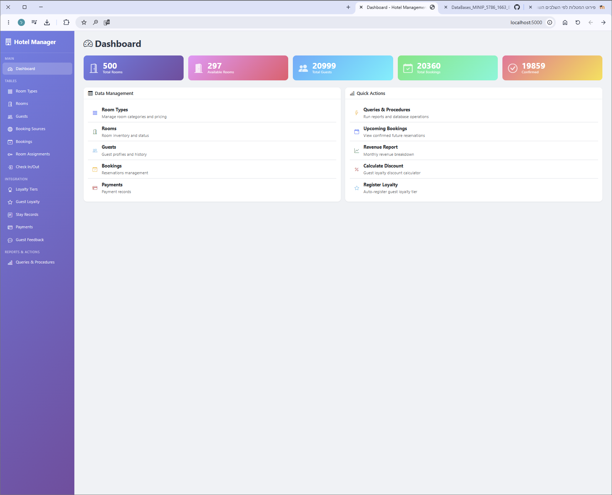

---

### 2. Rooms List - רשימת החדרים במלון
* **תיאור מילולי:** רשימת כל החדרים הקיימים במלון. מציגה את הקומה, סוג החדר וסטטוס הפניות שלו בעזרת תוויות צבעוניות (AVAILABLE, OCCUPIED, MAINTENANCE).
* **קישור להרצה:** `http://localhost:5000/rooms`
* **צילום מסך:**
  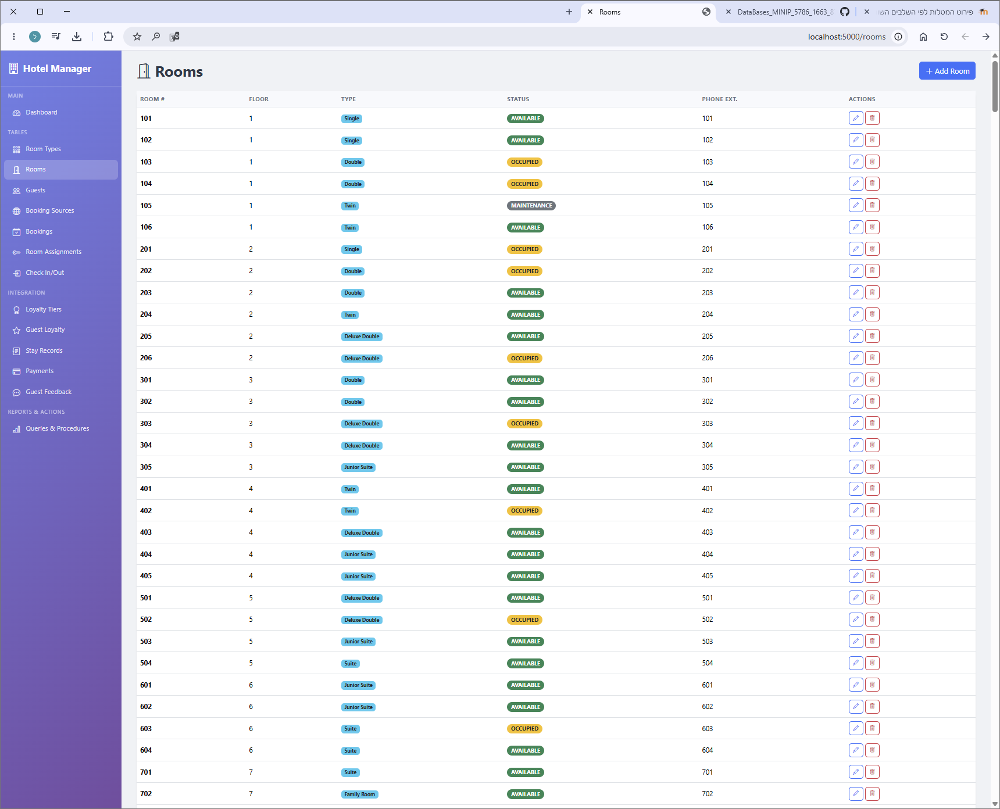

---

### 3. Add Booking - טופס יצירת הזמנה חדשה (CRUD - Create)
* **תיאור מילולי:** טופס להוספת הזמנה חדשה המאפשר בחירת אורח ומקור הזמנה מתוך תפריט בחירה (Dropdown) המציג שמות ידידותיים למשתמש במקום מזהים מספריים.
* **קישור להרצה:** `http://localhost:5000/bookings/add`
* **צילום מסך:**
  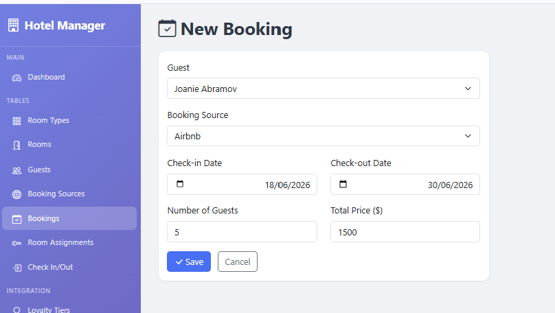
   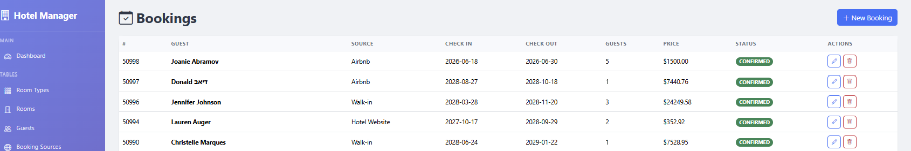


---

### 4. Bookings List - רשימת הזמנות (CRUD - Read)
* **תיאור מילולי:** מציג את רשימת כל ההזמנות שבוצעו במערכת, ממוינות מהחדשה לישנה, ומאפשר גישה מהירה למסכי העריכה או מחיקה של כל הזמנה.
* **קישור להרצה:** `http://localhost:5000/bookings`
* **צילום מסך:**
  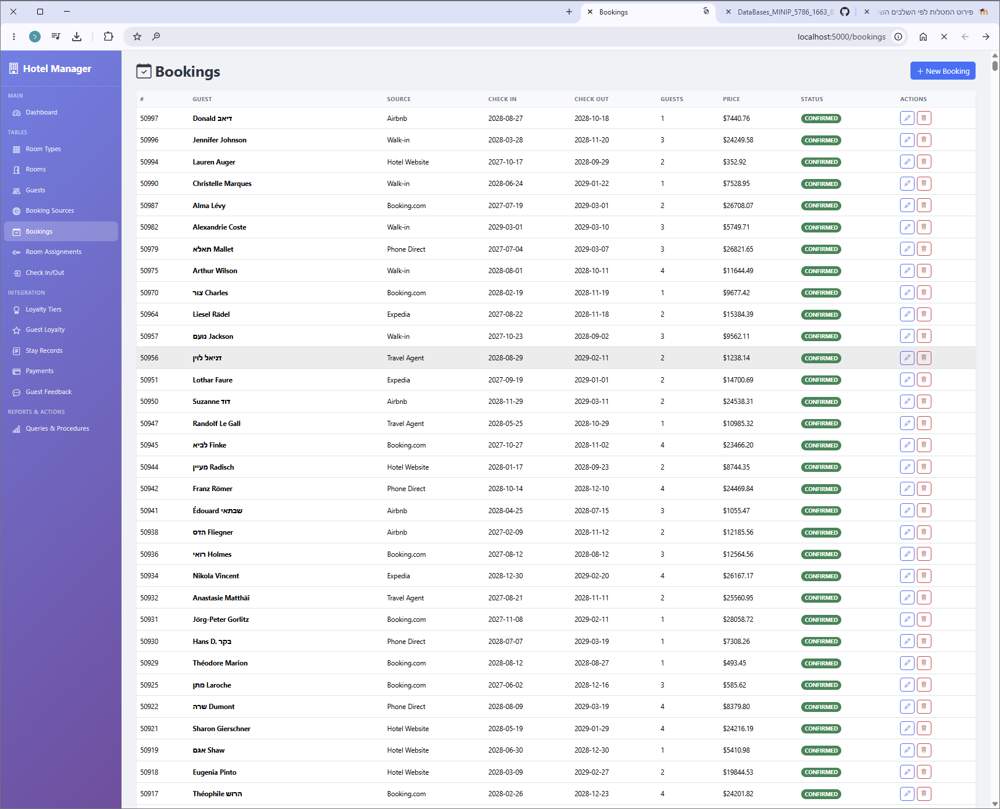

---

### 5. Edit Room Type - טופס עריכת סוג חדר (CRUD - Update)
* **תיאור מילולי:** טופס לעדכון פרטי סוג חדר קיים. בעת כניסה למסך זה, המערכת מזהה את מפתח סוג החדר וממלאת אוטומטית את שדות הטופס בפרטים הנוכחיים לשם עריכה קלה.
* **קישור להרצה:** `http://localhost:5000/room_types/edit/1`
* **צילום מסך:**
  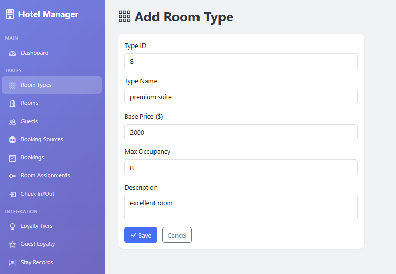
  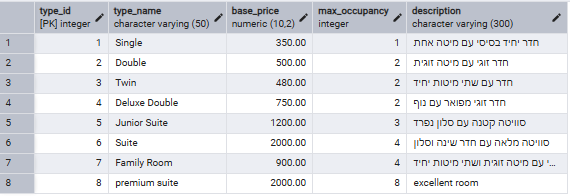

---

### 6. Guests List - רשימת אורחים
* **תיאור מילולי:** רשימת כל האורחים הרשומים במערכת המציגה את פרטיהם האישיים וכן את דרגת מועדון הנאמנות שלהם במידה והם רשומים לתוכנית הנאמנות.
* **קישור להרצה:** `http://localhost:5000/guests`
* **צילום מסך:**
  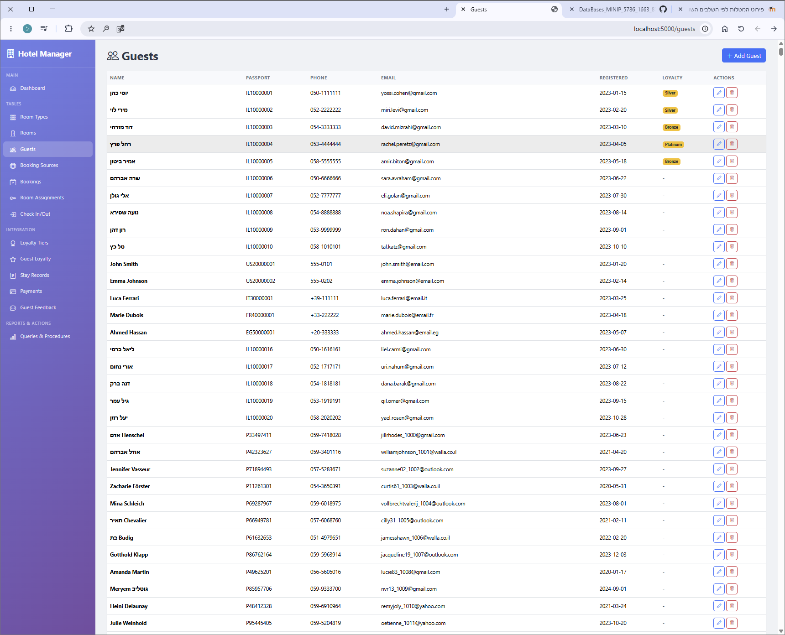

---

### 7. Guest Feedback - פידבקים מאורחים
* **תיאור מילולי:** מציג את רשימת הפידבקים שהשאירו אורחים על שהיותיהם במלון, כולל דירוג כוכבים, הערה מילולית ותאריך השארת הפידבק.
* **קישור להרצה:** `http://localhost:5000/feedback`
* **צילום מסך:**
  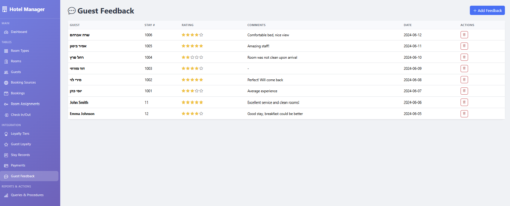

---

### 8. Queries Hub - מרכז שאילתות ופעולות
* **תיאור מילולי:** מסך הניהול הראשי של השאילתות משלב ב' והפרוצדורות/פונקציות משלב ד', המאפשר הרצה שלהן בלחיצת כפתור ישירות מהממשק.
* **קישור להרצה:** `http://localhost:5000/queries`
* **צילום מסך:**
  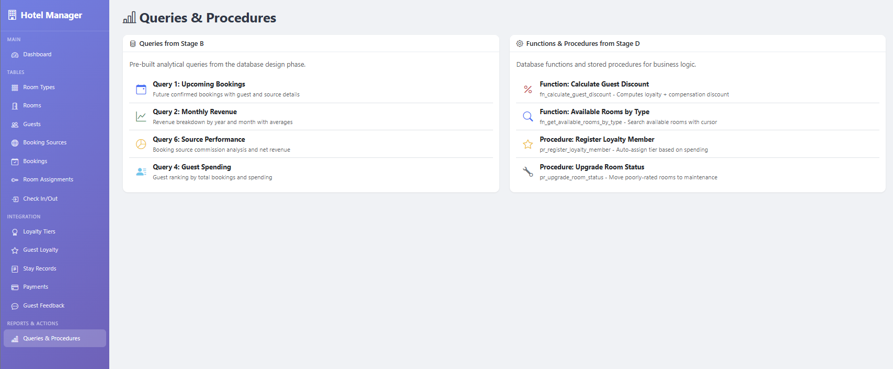

---

### 9. Monthly Revenue - תוצאות שאילתת הכנסות
* **תיאור מילולי:** מציג את תוצאות הרצת שאילתת רווחים חודשיים משלב ב' המציגה את כמות ההזמנות, סך ההכנסות ומחיר ממוצע בחלוקה לפי חודש ושנה.
* **קישור להרצה:** `http://localhost:5000/queries/monthly_revenue`
* **צילום מסך:**
  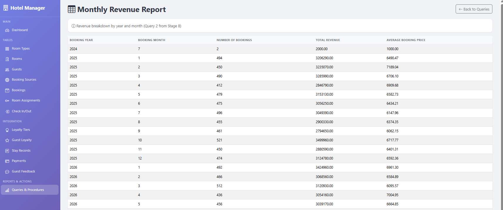

---

### 10. Calculate Discount - חישוב הנחה לאורח (פונקציה)
* **תיאור מילולי:** מסך המאפשר להפעיל את הפונקציה `fn_calculate_guest_discount` על אורח ומחיר ספציפי, ומציג את המחיר המקורי לצד המחיר הסופי לאחר הנחה ופיצוי.
* **קישור להרצה:** `http://localhost:5000/queries/calculate_discount`
* **צילום מסך:**
  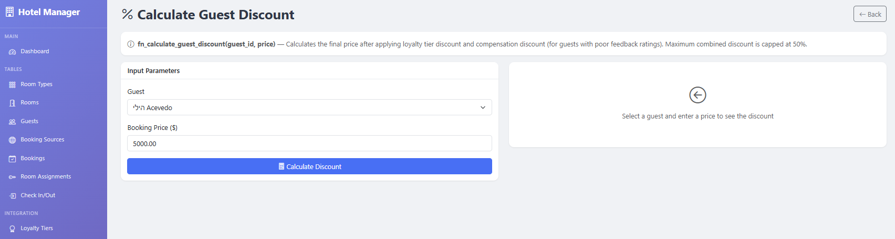

---

### 11. Register Loyalty - רישום אורח למועדון נאמנות (פרוצדורה)
* **תיאור מילולי:** מסך המאפשר להפעיל את הפרוצדורה `pr_register_loyalty_member` עבור אורח נבחר, ומחשב ומעדכן את דרגת הנאמנות שלו על בסיס סך הוצאותיו.
* **קישור להרצה:** `http://localhost:5000/queries/register_loyalty`
* **צילום מסך:**
  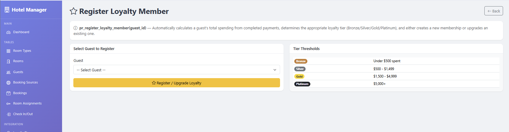

---

### 12. Payments List - רשימת תשלומים
* **תיאור מילולי:** מציג את רשימת כל התשלומים שבוצעו במערכת, מקושרים לשם האורח הרלוונטי ושיטת התשלום שבוצעה.
* **קישור להרצה:** `http://localhost:5000/payments`
* **צילום מסך:**
  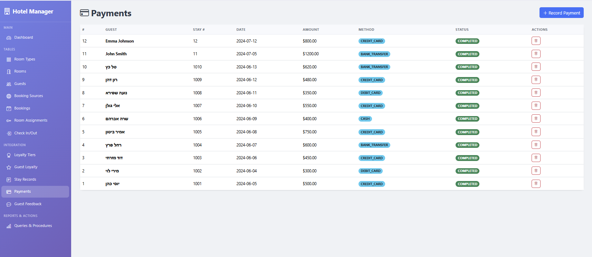
